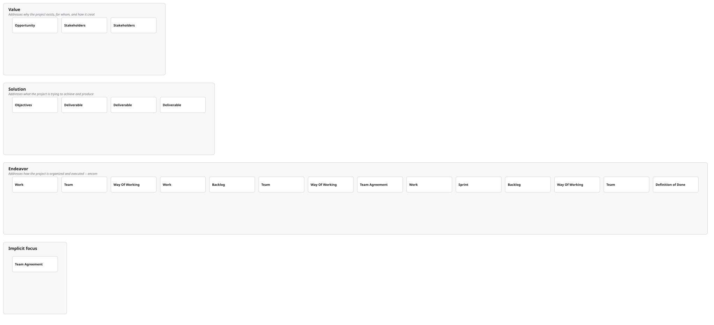

# Alpha Contributes Layout

## Purpose
Computes geometry for rendering alpha contribution hierarchies within swimlanes. Alphas that contribute to other alphas are positioned in rows below their parents.

## Layout Algorithm
FUNCTION computeAlphaContributorBelowLayout(alphas):
  Row 0: root alphas (no in-lane parent)
  Each contributesTo target sits one row above its contributor
  Children centred horizontally under parent
  Row compacted left without overlap
  Iterative passes (up to n+2) to stabilise row assignments
  RETURN layout with card positions

## Card Geometry
alphaCardGeom(index, row):
  RETURN { cx (centre x), top, bottom, left, right } for each card rectangle

## Edge Routing
Two path types:
1. contributeOrthogonalPathD: orthogonal routing for same-row connections
2. contributeEdgePathD / contributePathChildBelowParentRow: upward routing for cross-row connections

## Constants
- rowGap: 26
- bottomPad: 40
- TRACE_BELOW_CARD_BOTTOM: 22
- TRACE_STAGGER: 9
- MID_CHANNEL_JITTER: 2.5

## Cross-Lane Support
augmentLaneAlphasWithCrossLaneContributesParents: injects cross-lane parent alphas so edges can connect across swimlanes.

## Example

### Scrum Foundations Alpha Contributions

