# Overview Diagram

## Purpose
Visualises the alpha hierarchy (concerns mode) or activity space hierarchy (activities mode) grouped by focus. Used in both the interactive navigator and static site export.

## Concerns Mode ("Overview of Concerns")
Groups root alphas by focus name. For each root alpha, builds a hierarchical tree:
- Identifies direct children (both mapsTo and contributesTo)
- Measures subtree heights
- When total children height exceeds MULTI_COL_THRESHOLD (7 rows), splits into 1-3 balanced columns
- Column splitting: brute-force search for optimal split points minimising maximum column height
- Root card stretches to span all columns when multi-column

## Activities Mode ("Overview of Activities")
Groups activity spaces by focus name. Each space rendered as an arrow/chevron shape with child activities indented below. Same connection line and scoring logic as concerns mode.

## Layout Constants
- CARD_WIDTH: 180
- CARD_HEIGHT: 48
- CARD_GAP: 12
- INDENT: 42
- LINE_OFFSET: 21
- FOCUS_HEADING_HEIGHT: 40
- FOCUS_GAP: 32
- TEXT_SIZE: 11
- WRAP_WIDTH: 1100 (triggers row wrapping of tree blocks)

## Tree Building Algorithm
FUNCTION buildAlphaTree(rootAlpha, allAlphas, depth):
  IF depth > GRAPH_DEPTH_LIMIT: RETURN leaf node
  children = FILTER allAlphas WHERE contributesTo == rootAlpha.name OR mapsTo == rootAlpha.name
  FOR EACH child: recurse buildAlphaTree(child, remaining, depth+1)
  RETURN { alpha, children, height: sum of child heights }

FUNCTION splitIntoBalancedColumns(items, maxCols):
  IF totalHeight <= MULTI_COL_THRESHOLD: RETURN [items]
  FOR numCols in [2, 3]:
    Try all split point combinations
    Score = max column height across splits
    Keep combination with minimum score
  RETURN best split

## Edge Rendering
- contributesTo edges: vertical line from parent bottom to children, horizontal branches. Colour: semi-transparent gray, width 3
- mapsTo edges: coloured vertical bar (width 6, rounded corners) instead of line. Colour: semi-transparent blue

## Scoring Colours
Cards colour-coded by alpha/activity score (0-3 scale):
- 0: white/no fill
- 1: light blue
- 2: medium blue
- 3+: dark blue

## Click Behaviour (interactive only)
Clicking a card opens/toggles it as the selected element in the secondary panel.

## Static Export
Generates SVG string with identical layout constants. Uses foreignObject for HTML text content. Embeds font CDN URLs via defs/style for icon rendering.

## Examples

### Overview of Concerns (Scrum Foundations)

### Overview of Activities (Scrum Foundations)

