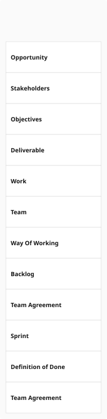

# Pattern Matrix Diagram

## Purpose
Renders a grid where columns are pattern views (lifecycle phases) and rows are alphas. Each cell shows which alpha state is reached in that phase, optionally with activity/activity-space lane chips.

## Data Model
- PatternMatrixCellBlock: { alphaName, stateName, lanes: LaneChip[], sliceInstances? }
- PatternMatrixLaneChip: { laneName, secondary, kind (activitySpace|activity), listOrigin, patternRef }
- PatternMatrixLayout: { width, height, headerH, rowHeights[], labelColW, colW, chipInnerW }

## Row Organisation
- buildPatternMatrixAlphaRows: groups alphas by focus (follows focus ordering), returns only ultimate root alphas using findUltimateRootInFocus (walks contributesTo chains)
- Column ordering follows patternView seq values

## Layout Algorithm
FUNCTION computePatternMatrixLayout(views, alphas, aliasLookup, lanesExpanded):
  Column widths: uniform based on available width
  Header height: max block height across all column headers (includes narrative contexts)
  FOR EACH row (alpha):
    Cell height = max across columns of stacked alpha-state blocks + optional lane arrows
  Row height = max cell height across all columns

## Block Measurement
- computeBlockHeightForWidth: nameLineH=18, descLineH=16, gap=8, y0=padY+22, bottomPad=22
- computeArrowHeightForWidth: minimum height 74
- Text wrapping: nameMaxChars = floor(contentWidth/8), descMaxChars = floor(contentWidth/7)

## Swimlane Focus Headings
- padTop: 18, nameLineH: 20, descLineH: 16, nameDescGap: 6, padBottom: 12, minHeight: 52
- Supports aliased name display (primary, primaryWithCanonical, canonicalContinuation rows)

## Lane Toggle
- LANE_TOGGLE_HEIGHT: 22
- Interactive: lanes can be expanded/collapsed
- Static/PDF: lanes always shown

## Example

### Scrum Foundations Pattern Matrix

