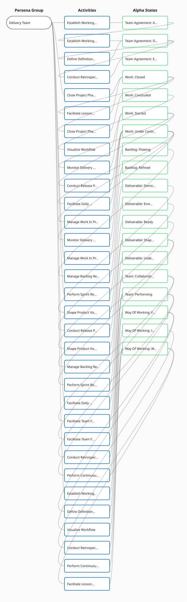

# Progressive Flow Diagram

## Purpose
Shows the sequential flow of activities and alpha state transitions per persona group. Each persona group gets its own flow with activity→state chains grouped by alpha thread.

## Data Model
- ProgressiveFlowData: { flows: PersonaGroupFlow[] }
- PersonaGroupFlow: { personaGroupName, nodes: FlowNode[], links: FlowLink[] }
- FlowNode: { type (personaGroup|activity|alphaState), id, label, alphaName?, stateName?, stateSeq?, description?, assetNames? }
- FlowLink: { sourceId, targetId }
- IDs prefixed by type: no prefix for personaGroup, activity for activities, alphaState for states

## Data Extraction
FUNCTION extractProgressiveFlowData(practice):
  FOR EACH persona group:
    Filter activities by persona group involvement
    Group activity-state contributions by alpha into "threads"
    Each thread: Activity → State → Activity → State sequential chains
    Sort threads by minimum stateSeq
  RETURN ProgressiveFlowData

## Layout
- nodeSpacing: 200 (horizontal distance between nodes)
- nodeHeight: 60
- threadSpacing: 90 (vertical distance between alpha threads)
- startX: 20, startY: 40
- PersonaGroup node at origin
- Each alpha thread as horizontal row, threads stacked vertically
- Chain traversal: Activity → State → Activity → State following links

## Node Shapes
- PersonaGroup: rectangle with rounded corners, width 160
- Activity: chevron polygon with notch=20, width 180
- AlphaState: rectangle with rounded corners, width 160, optional icon

## Edge Paths
Cubic bezier curves: controlOffset = min(deltaX/2, 60), dashed stroke (8 4 pattern)

## Colours
- PersonaGroup: purple tint (fill: semi-transparent purple, stroke: purple)
- Activity: primary blue fill, white text
- AlphaState: green tint (fill: semi-transparent green, stroke: green)
- Links: gray, semi-transparent

## Example

### Scrum Team Progressive Flow

