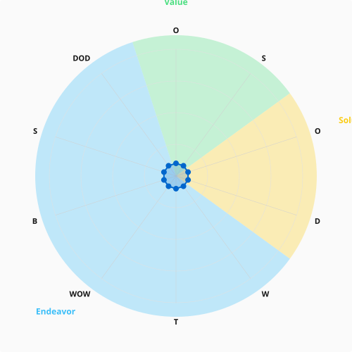

# Radar Chart

## Purpose
Polar chart showing alpha coverage scores. Each alpha is a spoke; the data polygon shows how far each alpha's score extends.

## Data Model
- RadarDataset: { spines: RadarSpine[], maxScore, focusSegments[] }
- RadarSpine: { label, description, value, focus, angle, index }

## Data Transformation
FUNCTION transformAlphaScoresToRadar(alphaScoresByFocus, focusOrder?):
  Flatten alpha scores across focus groups into spine list
  Distribute angles evenly: angleStep = 360 / spineCount
  Default focus ordering: ["Value", "Solution", "Endeavor"]
  Compute focus segments (pie slices) from contiguous spines of same focus
  RETURN RadarDataset

## Geometry
- Polar to Cartesian: angle 0 at top, clockwise rotation
  x = centerX + radius × sin(angle × π/180)
  y = centerY - radius × cos(angle × π/180)
- Data polygon: connect points at (value/maxScore × maxRadius) from centre
- Focus segment paths: SVG arc from startAngle to endAngle at full radius

## Size Variants
- icon: 80×80, radius 28
- small: 150×150, radius 55
- medium: 250×250, radius 90
- large: 400×400, radius 145

## Rendering Layers (back to front)
1. Focus segment backgrounds (pie slices with semi-transparent fill)
2. Grid circles (5 levels at 0.2 increments, gray semi-transparent stroke)
3. Spine lines (center to edge)
4. Data polygon (semi-transparent blue fill, solid blue stroke, width 2)
5. Data points (blue circles, radius 2 or 3)
6. Labels (initialism in coloured rectangles at 1.15× radius)

## Focus Colours
- Value: green (#4ade80, fill rgba(74,222,128,0.3))
- Solution: yellow (#facc15, fill rgba(250,204,21,0.3))
- Endeavor: blue (#38bdf8, fill rgba(56,189,248,0.3))
- Unknown: gray fallback

## Label Initialism
- Single word: first letter
- Multiple words: first letter of each word
- camelCase: capital letters

## Example

### Scrum Foundations Alpha Coverage

