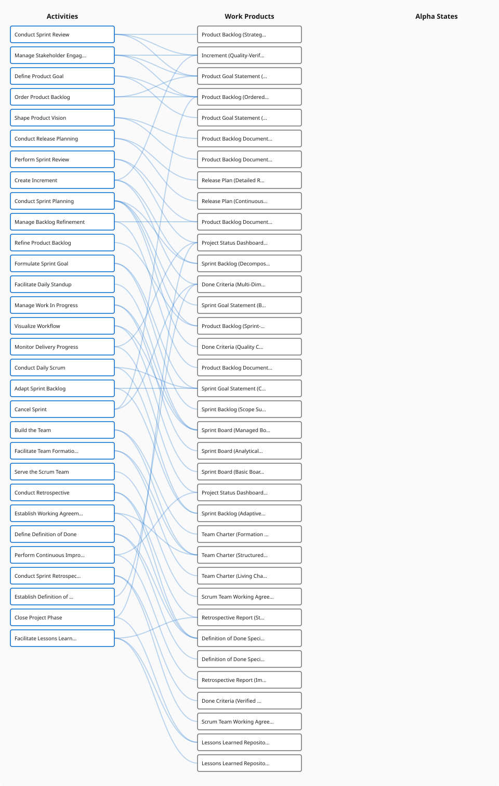

# Sankey Flow Diagram

## Purpose
Flow diagram showing how activities produce work products that evidence alpha states. Uses a standard Sankey layout algorithm for node positioning.

## Data Model
- SankeyFlowData: { nodes: SankeyNode[], links: SankeyLink[] }
- SankeyNode: { id, name, category (activity|workProduct|alphaState), description?, parentName?, assetNames? }
- SankeyLink: { source, target, value }
- IDs prefixed: "activity:Name", "workProduct:Name@Level", "alphaState:Alpha→State"

## Data Extraction
FUNCTION extractSankeyFlowData(practice):
  FOR EACH activity:
    FOR EACH worksOn (work product contribution):
      Create link: activity → workProduct
      FOR EACH LOD contributesTo (alpha contribution):
        Create link: workProduct → alphaState
    FOR EACH direct contributesTo (no intermediate work product):
      Create link: activity → alphaState
  Deduplicate nodes, increment link values for duplicates
  RETURN SankeyFlowData

## Layout
- Uses standard Sankey layout algorithm for node positioning
- nodeWidth: 20, nodePadding: 20
- Margins: { top: 20, right: 160, bottom: 20, left: 160 }
- Default dimensions: 1400×800

## Rendering
- Links: horizontal curves, gray stroke, width = max(1, linkWidth), semi-transparent
- Nodes: rectangles with rounded corners (rx=3), dark stroke
- Labels: positioned left or right based on node horizontal position (left half vs right half)
- Text truncated at 30 characters

## Category Colours
- activity: blue (#0066cc)
- workProduct: amber (#f59e0b)
- alphaState: green (#10b981)
- Link default: light gray (#cbd5e1); hover: dark gray (#475569)

## Interactivity
- Hover on node: highlights connected links
- Hover on link: highlights the link

## Example

### Scrum Foundations Sankey Flow

