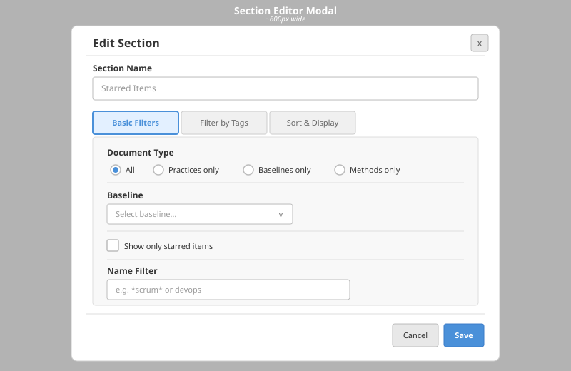
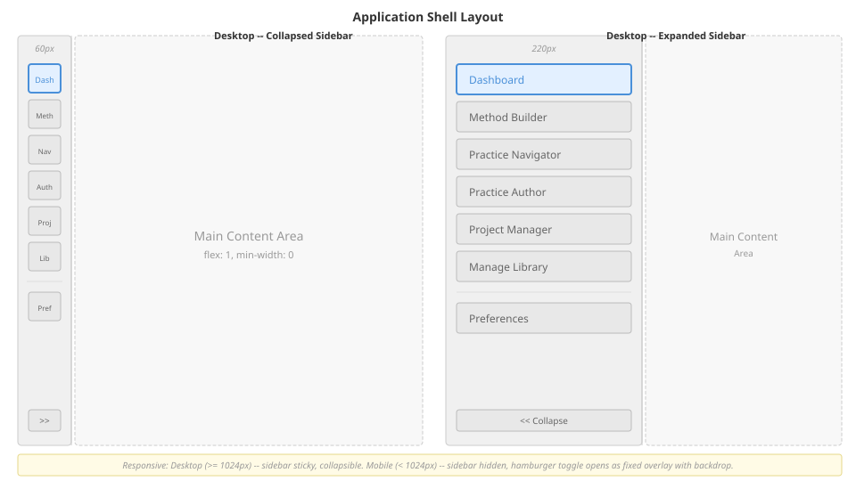
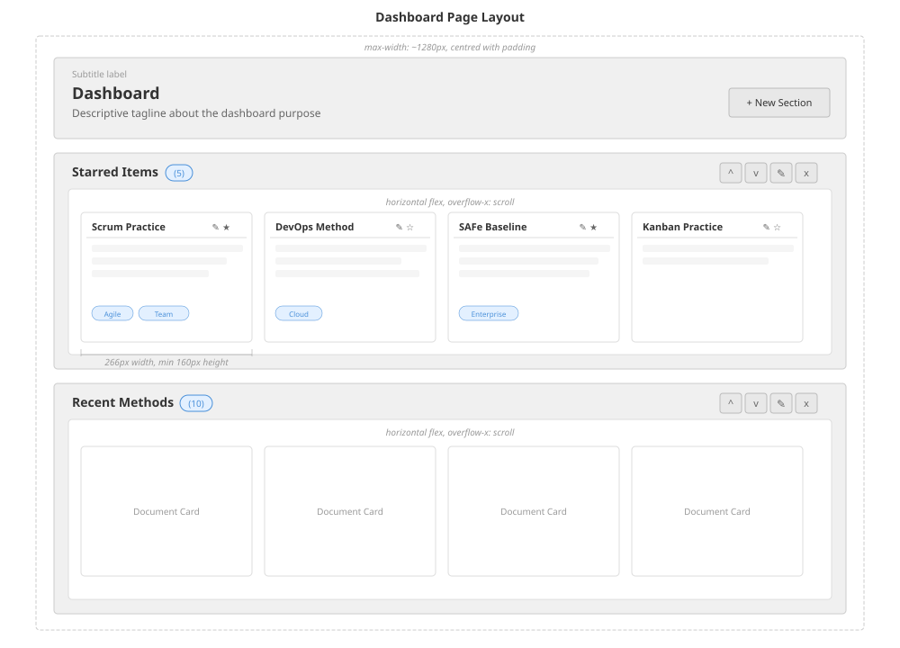

# Dashboard

## Purpose

The dashboard is the application's home page, served at the root route (`/`). It functions as a curated library browser organised into user-configurable sections. Each section is a horizontal carousel of document cards whose contents are determined by configurable filters and sort criteria. Users can star documents, create and reorder sections, and navigate directly to the appropriate editor or navigator view from any card.

The dashboard configuration is persisted as a regular document (kind `dashboard-config`) so that it participates in the same storage abstraction as all other data. On first visit, a default configuration is created automatically with three starter sections.

---

## Data Model

### DashboardConfig

```
DashboardConfig
  version       : 1 (literal)
  sections      : DashboardSection[]
  starredDocumentIds : string[]
```

### DashboardSection

```
DashboardSection
  id       : string (UUID)
  name     : string
  seq      : number           -- determines display order (ascending)
  filters  : SectionFilters
  sortBy   : SortCriterion[]  -- up to 4 criteria, applied in order
  maxItems : number (optional) -- caps the number of cards shown
```

### SectionFilters

```
SectionFilters
  kind              : "practice" | "method" | "baselinePractice" (optional)
  domainTags        : string[] (optional)
  lifecycleTags     : string[] (optional)
  organizationalTags: string[] (optional)
  baselineName      : string (optional)
  namePattern       : string (optional) -- case-insensitive substring; * is wildcard
  onlyStarred       : boolean (optional)
```

### SortCriterion

```
SortCriterion
  field     : "starred" | "completeness" | "title" | "updatedAt"
  direction : "asc" | "desc"
```

### EnrichedMeta

Enriched metadata for each document, used for filtering, sorting, and card display.

```
EnrichedMeta
  id                 : string
  title              : string
  kind               : string
  displayName        : string (optional)
  description        : string (optional)
  libraryRootKind    : string (optional) -- "practice" | "method" | "baselinePractice"
  virtualFileCount   : number (optional)
  libraryTags        : { domainTags: string[], lifecycleTags: string[], organizationalTags: string[] } (optional)
  associatedBaselineName : string or null (optional)
  updatedAt          : string
  createdAt          : string
  body               : opaque (optional) -- used for classification fallback
```

### Completeness Score

A fast structural approximation computed from element counts within the document body:

```
score = (count of alphas * 3) + (count of activities * 2) + (count of workProducts * 2)
```

For method documents containing embedded practices, the score is calculated recursively across all embedded practices and summed.

---

## Behaviours

### Initial Load

1. Load the dashboard configuration document by querying stored documents filtered to kind `dashboard-config`.
   - If at least one configuration document exists, use the first one.
   - If none exists, create a default configuration (see Default Configuration below) and persist it as a new document.
   - The configuration is cached in memory as a singleton. Concurrent loads during the initial request wait on the same promise rather than issuing duplicate requests.
2. In parallel with step 1 (once the config is available), fetch:
   - All enriched document metadata (with library detail fields).
   - The bundle library index.
3. Synthesise bundle-only entries into EnrichedMeta objects. A bundle entry is "bundle-only" when no flat-store document shares its name. Bundle entries receive a synthetic id of the form `bundle:<slug>/<path>`.
4. Exclude any document with kind `dashboard-config` from the display set.
5. Calculate completeness scores for every remaining document and store them in a score lookup keyed by document id.

### Default Configuration

When no dashboard configuration exists, create one with three sections:

| Section | Filters | Sort Criteria | Max Items |
|---|---|---|---|
| Starred Items | `onlyStarred = true` | completeness desc, updatedAt desc | none |
| Recent Methods | `kind = method` | starred desc, updatedAt desc | 10 |
| High Completeness | (none) | starred desc, completeness desc, title asc | 15 |

### Per-Section Filtering

For each section, the full document set is filtered and sorted independently.

**Filter application order (all conditions are AND-combined across categories):**

1. Always exclude documents with kind `dashboard-config`.
2. If `onlyStarred` is true, retain only documents whose id appears in `starredDocumentIds`.
3. If `kind` is set, retain only documents whose `libraryRootKind` matches.
4. If `baselineName` is set, retain only documents whose `associatedBaselineName` matches.
5. If `domainTags` is non-empty, retain documents that have at least one matching domain tag (OR within category).
6. If `lifecycleTags` is non-empty, retain documents that have at least one matching lifecycle tag (OR within category).
7. If `organizationalTags` is non-empty, retain documents that have at least one matching organisational tag (OR within category).
8. If `namePattern` is set:
   - If the pattern contains `*`, convert to a regular expression (escaping other special characters, replacing `*` with `.*`) and test against both `title` and `displayName`.
   - Otherwise, perform a case-insensitive substring match against both `title` and `displayName`.

### Per-Section Sorting

After filtering, documents are sorted by the section's `sortBy` criteria applied in sequence (multi-level stable sort, up to 4 criteria). Each criterion specifies a field and a direction:

| Field | Comparison | Default semantic for "desc" |
|---|---|---|
| `starred` | Boolean: is the document id in `starredDocumentIds`? | Starred items first |
| `completeness` | Numeric: completeness score | Highest score first |
| `title` | Locale-aware string comparison | Z to A |
| `updatedAt` | String comparison on ISO date | Newest first |

If `maxItems` is set, truncate the sorted result to that many items.

### Star Toggling

1. Compute the new `starredDocumentIds` list (add the id if absent, remove it if present).
2. Apply the change to the in-memory configuration immediately (optimistic update) so the UI reflects the change without waiting for persistence.
3. Persist the updated configuration to the storage backend.
4. If persistence fails, revert the in-memory configuration to its previous state.

### Section Management

**Create:** Open the section editor modal with no initial values. On save, assign a new UUID as the section id and set `seq` to one greater than the current maximum `seq` value. Apply optimistically, then persist.

**Update:** Open the section editor modal pre-populated with the section's current values. On save, replace the section in the sections array (matched by id). Apply optimistically, then persist.

**Delete:** Show a confirmation dialog naming the section. On confirmation, remove the section from the array. Apply optimistically, then persist. The confirmation dialog is dismissed by the Cancel button, the Escape key, or clicking the backdrop.

**Reorder (move up / move down):** Sort sections by `seq` to determine visual order. Swap the `seq` values of the target section and its adjacent sibling. The move-up action is disabled for the first section; move-down is disabled for the last. Apply optimistically, then persist.

All section mutations follow the same optimistic update pattern: apply the change to in-memory state immediately, persist asynchronously, and revert on failure.

### Section Editor



The section editor is presented as a modal dialog with a required section name field and three tabs:

**Tab 1 -- Basic Filters:**
- Document type: radio group with options All / Practices only / Baselines only / Methods only. Maps to the `kind` filter (or absence of it for "All").
- Baseline: dropdown selector populated from the set of distinct `associatedBaselineName` values across all documents. Only shown when at least one baseline name exists in the data. Maps to the `baselineName` filter.
- Show only starred items: checkbox. Maps to the `onlyStarred` filter.
- Name filter: text input supporting `*` wildcard. Maps to the `namePattern` filter.

**Tab 2 -- Filter by Tags** (only shown when tags exist in the data):
- Domain tags: checkbox grid in a scrollable container, populated from distinct domain tags across all documents.
- Lifecycle tags: same layout, populated from distinct lifecycle tags.
- Organisational tags: same layout, populated from distinct organisational tags.
- Each tag category uses OR logic within the category; categories are AND-combined.

**Tab 3 -- Sort & Display:**
- Sort criteria: ordered list of up to 4 criteria. Each criterion has a field selector and a direction selector. Direction labels are context-sensitive (e.g. "Starred first" / "Unstarred first" for the starred field, "Highest first" / "Lowest first" for completeness, "Newest first" / "Oldest first" for updatedAt, "A to Z" / "Z to A" for title). Criteria can be added and individually removed (minimum one criterion must remain).
- Maximum items: optional numeric input.

On submission, if the section name is empty or whitespace-only, default to "Untitled Section". The editor assembles a `DashboardSection` object -- reusing the existing id and seq for updates, or generating new ones for creation -- and passes it to the save handler.

The modal is dismissed by the Cancel button, the Close button, the Escape key, or clicking the backdrop. While open, page scrolling behind the modal is suppressed.

---

## User Interactions

### Browsing the Dashboard

1. The user navigates to the root route.
2. While data loads, a loading indicator is displayed.
3. If configuration loading fails, an error message is shown.
4. Once loaded, sections appear stacked vertically, each displaying its name, a document count badge, and a horizontal carousel of document cards.
5. If a section's filters match no documents, a placeholder message is shown with a link to edit the section's filters.
6. If no sections exist at all, an empty-state panel is shown inviting the user to create their first section.

### Interacting with a Document Card

- **Click the card body:** Navigate to the practice navigator view for that document (or the bundle navigator view for bundle references).
- **Click the edit button:** Navigate to the appropriate editor -- practice author for practices and baselines, method builder for methods. For bundle references, navigate to the navigator view.
- **Click the star button:** Toggle the document's starred status. The star button visually reflects the current state (filled when starred, outlined when unstarred). The click event does not propagate to the card body.

### Managing Sections

- **Click "New Section"** in the page header to open the section editor in creation mode.
- **Click the edit icon** on a section header to open the section editor pre-populated with that section's configuration.
- **Click the delete icon** on a section header to trigger a delete confirmation dialog.
- **Click move-up or move-down** on a section header to reorder sections. Disabled controls have reduced visual prominence.

---

## Layout

### Application Shell



All pages are wrapped in a shared application shell consisting of:

- **Sidebar navigation:** A vertical navigation rail with 7 items: Dashboard, Method Builder, Practice Navigator, Practice Author, Project Manager, Manage Library, and Preferences. Preferences is separated from the main group by a visual divider.
  - On desktop (viewport width >= 1024px): the sidebar is sticky, always visible, and can be collapsed to an icon-only rail via a toggle button. When collapsed, items show only their icon with a tooltip for the label.
  - On mobile (viewport width < 1024px): the sidebar is hidden by default. A hamburger button in the top-left corner opens it as a fixed overlay with a backdrop. Clicking the backdrop closes the sidebar.
- **Main content area:** Fills the remaining horizontal space (`flex: 1, min-width: 0`).

### Dashboard Page Layout



- Content is horizontally centred with a maximum width of approximately 1280px and horizontal/vertical padding.
- **Header area:** Contains a subtitle label, a page title, a descriptive tagline, and a "New Section" action button aligned to the right.
- **Sections:** Stacked vertically with consistent gap spacing.

### Section Layout

*(See dashboard page wireframe above for section and card layout details.)*

- **Section header:** A row containing the section name (heading), a document count badge, and action buttons (move up, move down, edit, delete) aligned to the right.
- **Card carousel:** A horizontal flex container with horizontal overflow scrolling. Cards do not shrink below their fixed width.

### Document Card

*(See dashboard page wireframe above for card structure and dimensions.)*

- Fixed width of 266px, minimum height of 160px.
- Vertically stacked content:
  1. **Header row:** Document title (from `displayName` or `title`) on the left; edit button and star toggle button on the right.
  2. **Description:** Truncated to 3 lines via line clamping.
  3. **Tags:** Displayed as small pill badges in a wrapping flex row. All tag categories (domain, lifecycle, organisational) are combined into a single flat list.

---

## Integration Points

### Storage Layer

- The dashboard configuration is stored as a document with kind `dashboard-config` through the standard document storage API. It participates in the same CRUD operations and storage abstraction as all other documents.
- Configuration persistence uses the documents API endpoints: list (with kind filter), get by id, create, and update.

### Document Metadata API

- Document metadata (with enriched library fields) is fetched via the documents API with a detail flag.
- The library index API provides bundle entries that are synthesised into the same `EnrichedMeta` shape.

### Practice Navigator

- Clicking a document card navigates to the practice navigator view, passing either a `libraryId` query parameter (for flat-store documents) or `bundle` and `path` parameters (for bundle references).

### Practice Author and Method Builder

- The edit button on each card navigates to the practice author (for practices and baselines) or the method builder (for methods), passing the document id as a `libraryId` query parameter.

### Completeness Analysis

- The dashboard imports the simple completeness score calculation from the analysis module. This is a lightweight structural heuristic, not the full alpha-coverage analysis used elsewhere.

### Library Classification

- When a document's `libraryRootKind` is not available from the enriched metadata, the dashboard falls back to the library classification function to determine the document type from its body content.

### Navigation Configuration

- The sidebar navigation items are defined in a shared navigation configuration module, ensuring consistency across all pages that render the application shell.
