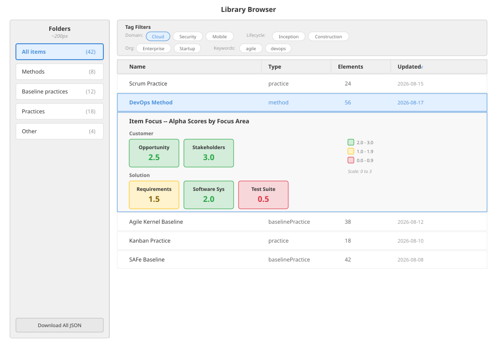

# Library System

## Purpose

The library system manages the storage, indexing, browsing, resolution, import, and export of practice documents. It provides two primary subsystems:

1. **Library Browser** -- a user-facing interface for discovering, filtering, sorting, and inspecting documents across installed bundles.
2. **Library Resolution Pipeline** -- a server-side engine that resolves document dependencies (baselines, extension practices, methods) into fully merged, renderable composites.

The library is organised around **bundles** -- self-contained collections of documents with manifests -- rather than individual loose files. A version-aware index aggregates all bundles into a single searchable catalogue, and a resolution pipeline turns name-based references into merged documents on demand.

---

## Data Model

### Document Classification

Every document entering the library is classified to determine its `LibraryRootKind`. Classification drives folder assignment, resolution strategy, and packaging behaviour.

```
TYPE LibraryRootKind = ENUM {
  changeSet,
  changeRequest,
  project,
  method,
  baselinePractice,
  practice,
  unknown
}
```

Classification uses a two-tier strategy: **explicit `kind`** first, then **structural inference** as fallback.

The schema defines a `kind` field on `PracticeElement` whose root-level values (`practice`, `method`, `practiceBaseline`, `project`) map directly to `LibraryRootKind`. When `kind` is present, it is authoritative — structural inference is skipped.

```
SCHEMA_KIND_TO_ROOT_KIND = {
  practiceBaseline → baselinePractice,
  practice         → practice,
  method           → method,
  project          → project
}
```

```
FUNCTION classifyLibraryRoot(body):
  -- Tier 1: explicit kind field (preferred)
  IF body.kind is a string AND body.kind IN SCHEMA_KIND_TO_ROOT_KIND
     THEN RETURN SCHEMA_KIND_TO_ROOT_KIND[body.kind]

  -- Tier 2: structural inference (legacy / kind-less documents)
  IF body has changeSetId                              THEN RETURN changeSet
  IF body has changeId AND body has operations (array)  THEN RETURN changeRequest
  IF body has plan (object) AND current (object) AND target (object)
     AND (practiceName OR methodName)                   THEN RETURN project
  IF body has baselinePractice (object)                 THEN RETURN method
  IF body has practices (non-empty array)               THEN RETURN method
  IF body has practiceNames (non-empty array)           THEN RETURN method
  IF body has baselinePracticeName (string) AND practices (array) THEN RETURN method
  IF body has both alphas[] AND focuses[] (both populated)
     AND does NOT have non-empty practiceDependencyNames THEN RETURN baselinePractice
  IF body has baselinePracticeName (non-empty string)    THEN RETURN practice
  IF body has alphas[] AND focuses[]                     THEN RETURN baselinePractice
  RETURN unknown
```

The `kind` check takes precedence over all structural checks. Within the structural inference tier, the ordering of checks is significant — earlier discriminators (changeSet, changeRequest, project) are tested first because they may also contain fields that later checks would match. ChangeSet and ChangeRequest do not appear in the schema `kind` enum and always rely on structural inference.

### Library Index

The library index is the central catalogue built from all installed bundles. It maps normalised document names to multi-version entries.

```
TYPE LibraryEntry = {
  name:                   string
  documentType:           LibraryRootKind
  versions:               BundleDocumentRef[]    -- sorted semver descending
  activeRef:              BundleDocumentRef       -- highest version or workspace override
  description:            string
  tags:                   LibraryDocumentTags
  keywords:               string[]
  elementCount:           number
  associatedBaselineName: string | null
  updatedAt:              string (ISO 8601)
  createdAt:              string (ISO 8601)
}

TYPE BundleLibraryIndex = {
  entries:  Map<normalizedName, LibraryEntry>
  bundles:  BundleManifestInfo[]
  builtAt:  string (ISO 8601)
}
```

**Normalised name key:** `name.trim().toLowerCase()` with whitespace collapsed to single spaces.

### Library Lookup Index

A flattened, single-version view used by the resolution pipeline. Built from the library index by selecting one version per entry (active or overridden).

```
TYPE LibraryLookupIndex = {
  baselineByName:                Map<string, PracticeBaseline>
  standaloneBaselinePracticeKeys: Set<string>
  practiceByName:                Map<string, Practice>
  methods:                       Method[]
}
```

**Ingest order for building the lookup index:** standalone baselines first, then standalone practices, then methods. This ensures standalone artifacts take priority over embedded copies extracted from methods.

When multiple baselines claim the same name, a **structural richness heuristic** selects the canonical one. The heuristic weights element counts (alphas, focuses, activity spaces, competencies, states, checklist items, narrative types) to prefer the most complete artifact. Ties are broken by semver (higher wins), then by ingest order (standalone over embedded).

### Tag Model

Documents carry structured tags for faceted filtering.

```
TYPE LibraryDocumentTags = {
  domainTags:         string[]
  lifecycleTags:      string[]
  organizationalTags: string[]
}
```

For methods, tags are merged from the method-level tags and the embedded baseline practice's tags.

### Enriched Metadata (Browser)

The browser transforms index entries into a view model for rendering.

```
TYPE EnrichedMeta = {
  id:                   string        -- "bundle:<slug>/<path>" or flat-store ID
  title:                string
  kind:                 string
  displayName:          string
  libraryRootKind:      LibraryRootKind
  virtualFileCount:     number        -- element count from index
  libraryTags:          LibraryDocumentTags
  keywords:             string[]
  updatedAt:            string
  createdAt:            string
  activeVersion:        string | null
  availableVersions:    string[] | null
  bundleSlug:           string | null
  bundleDocumentPath:   string | null
}
```

### Documentation Closure

A set of element names referenced by a primary document, used to prune merged results down to relevant content.

```
TYPE DocumentationClosure = {
  focusNames:         Set<string>
  alphaNames:         Set<string>
  activitySpaceNames: Set<string>
  activityNames:      Set<string>
  competencyNames:    Set<string>
  workProductNames:   Set<string>
  personaNames:       Set<string>
  personaGroupNames:  Set<string>
  patternNames:       Set<string>
}
```

### Version Warning

Produced when declared dependency version constraints do not match resolved versions.

```
TYPE VersionWarning = {
  documentName:  string
  declaredRange: string          -- semver range (e.g. ">=1.0.0 <2.0.0")
  actualVersion: string
  kind:          "mismatch" | "orphan"
  message:       string
}
```

---

## Library Browser

### Route and Data Loading

The browser is mounted at the `/library` route. On mount, it performs two parallel fetches:

1. **Library index** -- the serialised `BundleLibraryIndex` from the index API.
2. **Dashboard config** -- loads the user's starred-document state.

Index entries are mapped to `EnrichedMeta` records. The synthetic ID for bundle-sourced documents is `"bundle:<slug>/<path>"`.

### Folder Navigation



A sidebar lists document-type folders, each showing a count of matching items:

| Folder ID          | Label                | Filter                          |
|-------------------|----------------------|---------------------------------|
| `all`             | All items            | No filter                       |
| `method`          | Methods              | `libraryRootKind = method`      |
| `baselinePractice`| Baseline practices   | `libraryRootKind = baselinePractice` |
| `practice`        | Practices            | `libraryRootKind = practice`    |
| `unknown`         | Other                | `libraryRootKind = unknown`     |

Clicking a folder filters the item list by `libraryRootKind`.

### Tag Filtering

*(See library browser wireframe above for tag filter bar layout.)*

Tags are filtered across four dimensions:

1. **Domain tags** (e.g. "Cloud", "Security")
2. **Lifecycle tags** (e.g. "Inception", "Construction")
3. **Organisational tags** (e.g. "Enterprise", "Startup")
4. **Keywords** (free-form strings)

**Filter logic:**
- **Within a dimension:** OR (any matching tag satisfies)
- **Across dimensions:** AND (all active dimensions must be satisfied)

Available tag values are collected from all items in the current folder, deduplicated, and sorted alphabetically. Toggling a tag adds or removes it from the active set for that dimension.

### Sorting

*(See library browser wireframe above for sortable column headers.)*

The item list is sortable by column:

| Column        | Sort key              | Default |
|---------------|-----------------------|---------|
| Name          | `displayName`         |         |
| Type          | `libraryRootKind`     |         |
| Elements      | `virtualFileCount`    |         |
| Updated       | `updatedAt`           | desc    |

Default sort order is **updated date, descending** (most recently modified first).

### Starring

Documents can be starred for quick access. Starred state is persisted in the dashboard configuration (not in the document itself). Toggling a star saves the updated dashboard config.

### Item Focus (Inline Expansion)

*(See library browser wireframe above for inline expansion with alpha score cards.)*

Clicking a library item expands an inline detail panel. The panel:

1. Fetches the document body from the bundle store.
2. Optionally resolves library dependencies (if the document references a baseline or practice dependencies).
3. Computes **alpha scores** grouped by focus area.
4. Displays scores as colour-coded cards on a 0--3 scale.

This provides a quick preview of a document's coverage without navigating away from the browser.

### Bulk Export

The browser provides a "Download All JSON" action that:

1. Fetches all documents with bodies from the document API.
2. Filters out dashboard-config documents.
3. Extracts the body from each document.
4. Downloads the array as a single JSON file.

---

## Bundle System

### Structure

A bundle is a directory containing:

```
<bundle-slug>/
  manifest.json
  documents/
    <document-slug-1>.json
    <document-slug-2>.json
    ...
```

### Bundle Manifest

```
TYPE BundleManifestInfo = {
  slug:          string
  name:          string
  version:       string
  description:   string
  documentCount: number
}
```

### Document References

```
TYPE BundleDocumentRef = {
  bundleSlug:          string
  documentPath:        string
  documentName:        string
  documentType:        LibraryRootKind
  documentVersion:     string
  isWorkspaceOverride: boolean
}

TYPE BundleDocumentMeta = BundleDocumentRef + {
  description:           string
  tags:                  LibraryDocumentTags
  keywords:              string[]
  elementCount:          number
  associatedBaselineName: string | null
  updatedAt:             string
  createdAt:             string
}
```

### Workspace Bundle

The workspace bundle (slug `"_workspace"`) holds user-created and edited documents. It has special rules:

- Cannot be deleted (deletion requests return 403).
- Documents in the workspace bundle are flagged with `isWorkspaceOverride = true`.
- Workspace overrides take priority over all other versions of the same document name during version selection.

### BundleStore Interface

The bundle store abstraction provides these operations:

| Operation             | Description |
|-----------------------|-------------|
| `listBundles`         | List all installed bundles (manifests only) |
| `getBundleManifest`   | Get a single bundle's manifest by slug |
| `getDocument`         | Read a single document body from a bundle |
| `importBundle`        | Import a .keleo ZIP, explode into a bundle directory |
| `removeBundle`        | Remove a bundle (403 for workspace) |
| `saveWorkspaceDocument` | Create or update a document in the workspace |
| `deleteWorkspaceDocument` | Delete a document from the workspace |
| `listAllDocuments`    | List all documents with bodies (for full index building) |
| `listAllDocumentMeta` | List pre-computed metadata from manifests (fast, no body reads) |
| `processInbox`        | Scan inbox directory, import found files |

### Index Building

```
FUNCTION buildBundleLibraryIndexFromMeta(documents, bundles):
  // Phase 1: Group by normalised name, then by version
  FOR EACH doc IN documents:
    nameKey = normalizeKey(doc.documentName)
    IF nameKey is empty THEN SKIP

    versionMap = entriesByKey.getOrCreate(nameKey)
    existing = versionMap.get(doc.documentVersion)

    IF existing AND shouldReplaceMeta(existing, doc) THEN
      versionMap.set(doc.documentVersion, doc)
    ELSE IF NOT existing THEN
      versionMap.set(doc.documentVersion, doc)

  // Phase 2: Build LibraryEntry from each name group
  FOR EACH (nameKey, versionMap) IN entriesByKey:
    versions = versionMap.values(), sorted by semver descending
    active = versions[0]         -- highest version (workspace overrides sort first)
    entry = new LibraryEntry from active metadata, with all versions
    entries.set(nameKey, entry)

  RETURN { entries, bundles, builtAt: now() }
```

**Replacement policy (`shouldReplaceMeta`):** When two metadata records share the same name and version:
1. Workspace overrides replace non-workspace documents.
2. Baseline-classified documents replace non-baseline documents (same name, same version).
3. Among baselines, the one with the higher element count wins.

### Pre-computed Metadata

To avoid reading document bodies during index building, metadata is pre-computed and stored in manifests.

```
FUNCTION computeDocumentMeta(body):
  RETURN {
    documentVersion:       body.version or "0.0.0"
    description:           body.description
    tags:                  libraryDocumentTags(body)
    keywords:              body.keywords (filtered to non-empty strings)
    elementCount:          count of virtual element files in body
    associatedBaselineName: derived from classification
    updatedAt:             body.updatedAt
    createdAt:             body.createdAt
  }
```

When pre-computed metadata is missing from a manifest, the system falls back to reading the document body, computing metadata, and backfilling the manifest.

### Version Selection

```
FUNCTION selectVersion(entry, versionOverrides):
  IF versionOverrides has a constraint for entry.name THEN
    FIND the first version in entry.versions that satisfies the constraint
    IF found THEN RETURN it

  RETURN entry.activeRef   -- default: highest version or workspace override
```

Version overrides are provided by a document's `dependencyVersions` array, which declares semver ranges for specific dependency names.

### Inbox Processing

The inbox (`data/inbox/`) supports drop-in file import:

```
FUNCTION processInbox():
  SCAN data/inbox/ for .keleo and .json files
  FOR EACH file:
    IF .keleo THEN import as bundle (unzip, validate manifest, write files)
    IF .json  THEN save to workspace bundle
    MOVE processed file to data/inbox/processed/
  RETURN count of processed files
```

Inbox processing is triggered on library index cache miss -- when the cached index has expired, the index API endpoint processes the inbox before rebuilding the index.

---

## Library Resolution Pipeline

The resolution pipeline transforms documents with name-based references into fully merged, renderable composites. Resolution is dispatched by document classification.

### Universal Dispatcher

```
FUNCTION resolveDocumentWithLibraryIndex(doc, index):
  root = classifyLibraryRoot(doc)
  SWITCH root:
    CASE method:           RETURN resolveMethodWithLibraryIndex(doc, index)
    CASE baselinePractice: RETURN resolveBaselinePracticeWithLibraryIndex(doc, index)
    CASE practice:         RETURN resolvePracticeWithLibraryIndex(doc, index)
    DEFAULT:               RETURN doc (unchanged)
```

### Baseline Resolution

Baselines can declare `baselinePracticeNames` to compose from other baselines.

```
FUNCTION resolveBaselineWithDependencies(baseline, index):
  IF baseline has no baselinePracticeNames THEN RETURN baseline unchanged

  chain = orderedTransitiveBaselinePractices(baseline, index)
  IF chain has <= 1 entry THEN RETURN baseline unchanged

  seed = chain[0] (deepest dependency)
  overlays = chain[1..n] converted to practice-shaped overlays
  method = { baselinePractice: seed, practices: overlays }
  merged = compositePracticeFromMethod(method)
  REMOVE mergesBaselinePracticeName and baselinePracticeName from merged
  RETURN merged as PracticeBaseline
```

### Practice Resolution

Practices reference a baseline by name and may declare transitive dependencies on other practices.

```
FUNCTION resolvePracticeWithLibraryIndex(primary, index):
  IF practice does not need resolution THEN RETURN primary unchanged

  baseline = findBaselineInLibrary(index, primary.baselinePracticeName)
             OR extract baseline shape from primary itself
  IF no baseline found THEN RETURN primary unchanged

  extensions = orderedTransitiveExtensionPractices(primary, index)

  method = { baselinePractice: baseline, practices: extensions }
  merged = compositePracticeFromMethod(method, index)

  // Fix unresolved focus names from source chain
  fillUnresolvedFocusNamesFromSourceChain(merged, [baseline, ...extensions])

  // Compute documentation closure from primary + dependency practices
  closure = collectPrimaryDocumentationClosure(primary)
  FOR EACH dependency practice (excluding primary):
    UNION dependency's closure into closure

  // Expand closure transitively along contribution edges
  expandDocumentationClosureFromMergedGraph(merged, closure)

  // Expand persona/persona-group membership
  expandPersonaSubgroupClosureInPlace(merged, closure)

  // Always include all baseline alphas and activity spaces
  FOR EACH alpha IN baseline.alphas:
    ADD alpha.name and alpha.focusName to closure
  FOR EACH space IN baseline.activitySpaces:
    ADD space.name, space.focusName, and all nested activity names to closure

  // Prune merged result to documentation closure
  IF closure is not empty THEN
    pruned = prunePracticeToDocumentationClosure(merged, closure, primary)
    RETURN pruned
  ELSE
    RETURN merged
```

### Method Resolution

Methods delegate to the practice composition engine (see Method Builder specification).

```
FUNCTION resolveMethodWithLibraryIndex(method, index):
  IF method does not need resolution THEN RETURN method unchanged
  RETURN compositePracticeFromMethod(method, index)
```

### Baseline Lookup

Finding a baseline in the library uses a three-tier fallback:

```
FUNCTION findBaselineInLibrary(index, requestedName):
  pool = all baselines from index (standalone + method-embedded, standalone preferred)

  // Tier 1: exact name match
  IF pool has requestedName THEN RETURN clone of it

  // Tier 2: normalised name match (case-insensitive, whitespace-collapsed)
  normalised = normalizeBaselinePracticeName(requestedName)
  candidates = all baselines where normalised name matches
  IF found THEN RETURN the richest among candidates

  // Tier 3: equivalence class fallback
  eqClass = equivalenceClassForRequestedName(normalised)
  IF eqClass exists THEN
    matches = baselines whose normalised name is in eqClass
    RETURN the richest match (prefer standalone artifacts)

  RETURN null
```

**Equivalence classes** handle known naming variations where the same logical baseline ships under different display names (e.g. "Platform Adoption Kernel" and "Platform Adoption Essentials").

### Transitive Dependency Traversal

Both baseline and practice dependencies are resolved using post-order depth-first search. Dependencies are processed before the documents that declare them, ensuring correct merge ordering.

```
FUNCTION orderedTransitiveExtensionPractices(primary, index):
  ordered = []
  done = Set<string>()
  visiting = Set<string>()      -- cycle detection
  MAX_DEPTH = 30

  FUNCTION visit(practice, depth):
    name = practice.name
    IF name is empty OR done.has(name) THEN RETURN
    IF visiting.has(name) THEN THROW circular dependency error
    IF depth > MAX_DEPTH THEN THROW depth limit error

    visiting.add(name)
    FOR EACH depName IN practice.practiceDependencyNames (unique, trimmed):
      IF depName = name THEN SKIP (self-reference)
      dep = findPracticeInLibrary(index, depName)
      IF dep exists THEN visit(dep, depth + 1)
    visiting.remove(name)

    done.add(name)
    ordered.push(clone(practice))

  visit(primary, 0)
  RETURN ordered
```

The same pattern applies to `orderedTransitiveBaselinePractices`, traversing `baselinePracticeNames` instead.

### Documentation Closure and Pruning

After merging, the result contains all elements from the baseline and all dependency practices. Pruning removes elements not relevant to the primary practice's documentation.

**Phase 1 -- Collect primary closure:** Walk the primary document and all dependency practices, collecting the names of every element they reference (alphas, focuses, activities, competencies, work products, personas, patterns).

**Phase 2 -- Expand along contribution edges:** Iteratively follow `contributesTo`, `mapsTo`, `supportingAlphas`, `worksOn`, and other cross-references in the merged document. Continue until no new names are added (fixed-point iteration).

**Phase 3 -- Expand persona subgroups:** Bidirectionally expand persona-group membership so that retaining any persona in a group also retains the group and vice versa. Add competency names from retained personas.

**Phase 4 -- Prune:** Remove from the merged result any element whose canonical name is not in the closure. Activity spaces that survive pruning have their nested activity lists filtered to retain only referenced activities.

### Dependency Version Checking

```
FUNCTION collectDependencyVersionWarnings(doc, index):
  constraints = doc.dependencyVersions (array of { documentName, versionRange })
  IF no constraints THEN RETURN []

  declaredDepNames = collect all dependency names from doc
    (baselinePracticeName, practiceDependencyNames, practiceNames, etc.)

  FOR EACH declaredDepName:
    resolved = find in library (baseline or practice)
    resolvedDeps.set(name, resolved.version or undefined)

  warnings = []
  FOR EACH constraint:
    actualVersion = resolvedDeps.get(constraint.documentName)
    IF not found in declared deps THEN
      ADD orphan warning
    ELSE IF actualVersion does not satisfy constraint.versionRange THEN
      ADD mismatch warning

  RETURN warnings
```

---

## Import and Export

### .keleo Package Format

A `.keleo` file is a ZIP archive containing:

```
manifest.json
documents/
  <slug-1>.json
  <slug-2>.json
  ...
```

#### Manifest Schema

```
TYPE PackageManifest = {
  schemaVersion: string         -- currently "1.2.0"
  package: {
    name:        string
    version:     string
    description: string
  }
  documents: [{
    path:         string        -- e.g. "documents/my-practice.json"
    documentType: string        -- practiceBaseline | practice | method | project | ...
    documentName: string
    entryPoint:   boolean?      -- true for the root document
  }]
  dependencies: [{              -- optional; present when transitive deps are missing
    packageName:  string
    versionRange: string
    documentNames: string[]?
  }]?
}
```

#### Method Externalisation

When packaging a method, embedded baselines and practices are extracted into separate document files with name-based references:

```
FUNCTION externalizeMethod(body):
  extractedDocs = []
  externalised = copy of body

  IF body has embedded baselinePractice (object) THEN
    EXTRACT baseline to a separate document
    REPLACE with baselinePracticeName (string reference)
    ADD baseline to extractedDocs

  IF body has embedded practices (array of objects) THEN
    EXTRACT each practice to a separate document
    REPLACE with practiceNames (array of string references)
    ADD each practice to extractedDocs

  RETURN { externalised, extractedDocs }
```

#### Transitive Dependency Inclusion

Package building recursively includes transitive dependencies:

```
FUNCTION buildKeleoPackage(body, allBodies):
  Classify the root document
  Add root document to the package (marked as entryPoint)

  FOR methods:
    Externalise embedded baselines and practices
    Add each extracted document
    Recursively follow baselinePracticeName and practiceDependencyNames

  FOR practices:
    Follow baselinePracticeName to include the baseline
    Follow practiceDependencyNames to include dependency practices

  FOR baselines:
    Follow baselinePracticeNames to include dependency baselines

  When a referenced document is not found in allBodies:
    Add it to the manifest's dependencies array (missing external dep)

  Generate unique document paths using slugified names
  Write manifest.json + all document files
  Compress as ZIP
```

#### Bundle Packaging

Multiple documents can be packaged into individual .keleo files and wrapped in an outer ZIP for bulk download.

### Import Paths

| Path | Trigger | Mechanism |
|------|---------|-----------|
| Upload modal | User action | Drag-and-drop or file picker for `.keleo` and `.json` files; posted as multipart form data to the bundles API |
| Inbox auto-import | Cache miss | Files dropped into `data/inbox/` are processed when the library index is rebuilt |
| Single binary upload | API call | POST to bundles API with binary content type |

For `.keleo` imports: unzip, validate the manifest, write the bundle directory, compute and persist metadata for each document.

For `.json` imports: save to the workspace bundle.

### Export Paths

| Path | Action | Output |
|------|--------|--------|
| Download All JSON | Fetch all documents with bodies, filter out dashboard configs, export as JSON array | Single `.json` file |
| Download Selected | Fetch individual document body | Single `.json` file |
| Export .keleo | Build package with transitive dependencies | Single `.keleo` file |
| Static site export | Generate self-contained HTML site from bundle document | `.zip` archive |

---

## Integration Points

### Storage Layer

The library system depends on two storage abstractions:

- **JsonStore** (`getJsonDocumentStore`) -- legacy flat document store for backward compatibility. Used as a secondary source during full library body loading.
- **BundleStore** (`getBundleStore`) -- primary storage for the bundle-organised library. Provides manifest-based document management, inbox processing, and metadata pre-computation.

Both are configured via environment variables and accessed through the storage abstraction layer. The library system never accesses the filesystem or database directly.

### Practice Composition Engine

The resolution pipeline delegates to `compositePracticeFromMethod` (see Method Builder specification) for the actual merge logic. The library system is responsible for:

- Locating and loading the correct baseline and practice documents from the library.
- Ordering dependencies in correct merge sequence (post-order DFS).
- Post-processing the merge result (focus name resolution, documentation closure, pruning).

### Caching

The library index is cached server-side with a TTL. Cache behaviour:

- **Cache hit:** Return the cached serialised index immediately.
- **Cache miss:** Process the inbox, rebuild the index from manifests, cache the result, then return it.

This means inbox processing is deferred until the cache expires, avoiding unnecessary filesystem scans on every request.

### Dashboard System

The library browser reads and writes dashboard configuration for starred-document state. Starring is a browser-level concept -- it does not modify documents or bundles.

### Practice Navigator

Resolved documents from the library feed into the practice navigator for interactive exploration. The navigator calls the batch-resolve API to resolve multiple documents in a single request.

### Static Site Export

The static site export system reads documents from bundles and generates self-contained HTML sites. It uses the same resolution pipeline to merge dependencies before rendering.

### API Endpoints

| Endpoint | Method | Description |
|----------|--------|-------------|
| `/api/library/index` | GET | Serialised `BundleLibraryIndex` (cached; processes inbox on cache miss) |
| `/api/library/document` | GET | Single document body from a bundle (`?bundle=&path=`) |
| `/api/library/batch-resolve` | POST | Resolve multiple documents in one request (max 100) |
| `/api/library/baseline-alphas` | GET | Alpha names from a named baseline (`?name=`) |
| `/api/library/static-site` | GET | Static site ZIP for a bundle document (`?bundle=&path=`) |
| `/api/library/practices/by-tags` | GET | Server-side tag filtering (`?tags=&matchMode=`) |
| `/api/bundles` | GET | List installed bundles |
| `/api/bundles` | POST | Import files (multipart form data or binary) |
| `/api/bundles/<slug>` | GET | Single bundle manifest |
| `/api/bundles/<slug>` | DELETE | Remove bundle (403 for workspace) |
| `/api/bundles/inbox` | POST | Trigger inbox processing |

All API routes are thin controllers. Business logic for indexing, resolution, and packaging resides in the library modules; API routes validate input, delegate, and return appropriate HTTP status codes.

---

**Last Updated**: 2026-08-17
