# Practice Navigator

## Purpose

The Practice Navigator is the primary read-only exploration view for practice and method documents. It provides a structured, hierarchical interface for browsing all elements of a practice -- alphas, activities, work products, patterns, competencies, personas -- with contextual drilldown into sub-elements. The navigator replaces the earlier browse view with a richer, multi-panel layout that supports two complementary perspectives on a practice: **concerns** (what matters) and **activities** (what to do).

The navigator serves as the main consumption interface for practitioners who need to understand, reference, or teach a practice without editing it. It supports both flat-store documents and bundle-sourced library documents, and optionally resolves practice dependencies to present a fully composed view.

---

## Navigation State

All navigator state is encoded in URL query parameters, making every view bookmarkable and shareable.

| Parameter    | Type     | Default              | Description |
|-------------|----------|----------------------|-------------|
| `libraryId` | string   | _none_               | Document identifier in the flat store. Mutually exclusive with `bundle`/`path`. |
| `bundle`    | string   | _none_               | Bundle slug for bundle-sourced documents. Used with `path`. |
| `path`      | string   | _none_               | Document path within the bundle. Used with `bundle`. |
| `mode`      | enum     | `"concerns"`         | Active sidebar perspective: `"concerns"` (alpha-centric) or `"activities"` (activity-centric). |
| `focus`     | string   | `null`               | Currently selected focus group name. |
| `selected`  | string   | `"__introduction__"` | Primary selected element name. Controls the centre panel content. |
| `secondary` | string   | `null`               | Secondary drilldown element name. When non-null, the right panel appears. |

**State transitions:** Each user interaction updates one or more URL parameters via the router. The `navigateToElement` action atomically sets `selected` and clears `secondary` in a single URL update, preventing a flash of stale secondary content.

---

## Layout System

The navigator renders a responsive multi-column grid layout.

### Column Structure

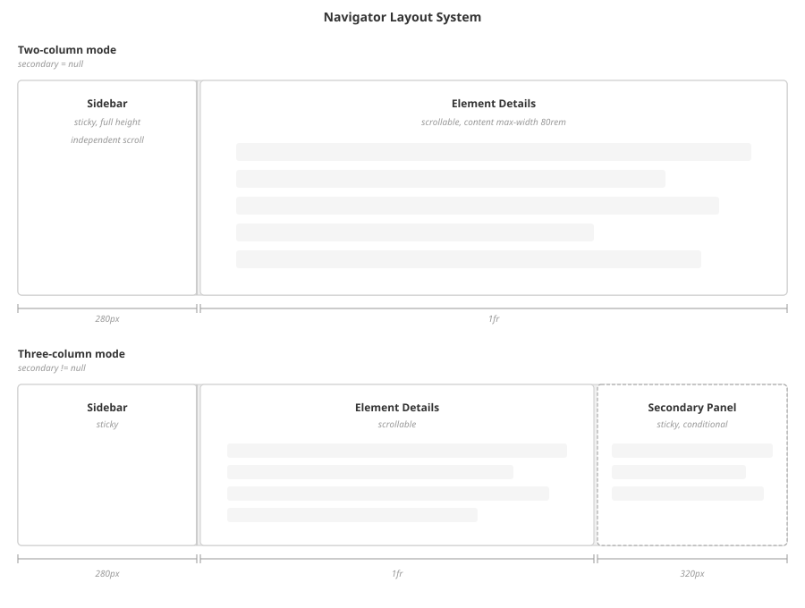

| Column   | Width       | Condition |
|----------|-------------|-----------|
| Left     | 280px fixed | Always visible |
| Centre   | Flexible    | Always visible |
| Right    | 320px fixed | Visible only when `secondary` resolves to content |

When no secondary content exists, the grid uses two columns (`280px 1fr`). When secondary content appears, the grid expands to three columns (`280px 1fr 320px`). The transition is immediate -- no animation.

### Panel Behaviour

- **Left (Sidebar):** Sticky-positioned, spans full viewport height, independently scrollable. Right border separates it from the centre panel.
- **Centre (Element Details):** Scrollable main content area. Content width is capped at 80rem except for the overview diagram, which uses full width.
- **Right (Secondary Details):** Sticky-positioned, full viewport height, independently scrollable. Only rendered when `secondaryElementData` is non-null.

---

## Sidebar

The sidebar provides hierarchical navigation through all practice elements. It is structured as a vertical stack of sections, each separated by dividers.

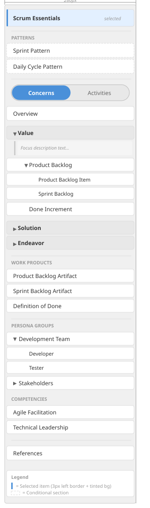

### Section Order (Top to Bottom)

1. **Introduction button** -- Selects `__introduction__`. Displays the practice name as its label. Always present.

2. **Patterns section** (conditional) -- Flat list of pattern buttons. Only rendered when the practice defines patterns. Followed by a horizontal divider.

3. **Mode toggle** -- Segmented control with two options: "Concerns" and "Activities". The active segment receives a highlighted background and border treatment. Switching mode changes which elements appear in the focus groups below.

4. **Overview button** -- Selects `__overview__`. Always present after the mode toggle.

5. **Focus groups** (collapsible) -- One collapsible section per focus area, each showing the focus name as a header. Clicking the header toggles expansion. When expanded, a focus description is shown (if available) as a left-bordered aside.

   - **Concerns mode:** Each focus group lists its root alphas (those without a `contributesTo` parent). Root alphas with children display expand/collapse arrows. Expanding a root alpha recursively renders its child alphas (filtered by `contributesTo === parentName`), indented at increasing depth. Child alphas that themselves have children are also expandable.
   - **Activities mode:** Each focus group lists its activity spaces. Activity spaces with child activities display expand/collapse arrows. Expanding an activity space renders its activities as an indented flat list.

6. **Work Products section** -- Flat list of all work products. Preceded by a horizontal divider and an uppercase section label.

7. **Roles & Competencies section** (conditional) -- Only rendered when the practice defines persona groups or competencies. Contains two sub-sections:
   - **Persona Groups** (sub-label "PERSONA GROUPS"): Expandable items. Each persona group can be expanded to reveal its child personas as an indented list.
   - **Competencies** (sub-label "COMPETENCIES"): Flat list of competency items.

8. **References button** -- Selects `__references__`. Always present at the bottom.

### Selection Indicator

The currently selected sidebar item receives a left border highlight (3px solid, primary colour) and a tinted background. All other items show a transparent 3px left border to maintain alignment.

---

## Element Details Panel

The centre panel renders detailed content for the currently selected element. Content structure varies by element type. When no element is selected, a placeholder message instructs the user to select an element from the sidebar.

### Source Practice Attribution

For all element types except references, the panel header includes the name of the source practice that contributed the element (either the element's `sourcePracticeName` or the baseline practice name). When the source practice exists in the library, an edit link is shown that navigates to either the practice author (for flat-store documents) or the navigator introduction (for bundle documents).

### Content by Element Type

#### Introduction (`__introduction__`)

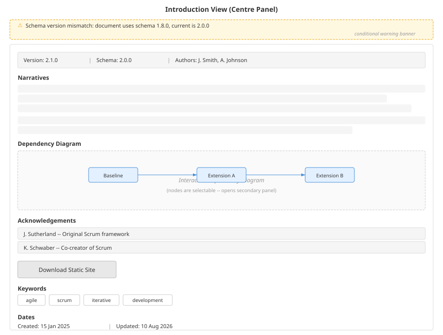

Displays the full practice/method overview:

1. **Version and schema info** -- Practice version, schema version, and author names.
2. **Narratives** -- Full narrative blocks rendered with citations and contextual formatting.
3. **Dependency diagram** -- An interactive diagram of practice dependencies, shown only when the dependency graph contains more than one node. Nodes in the diagram are selectable, opening the secondary panel.
4. **Acknowledgements** -- Named acknowledgements with optional descriptions and external links.
5. **Download static site button** -- Triggers generation and download of a ZIP archive containing markdown files and SVG diagrams for use with static site generators.
6. **Keywords** -- Displayed as a row of bordered badges.
7. **Dates** -- Created and updated timestamps formatted in the user's locale.
8. **Schema/version warnings** -- Alert banners shown above the panel content when schema compatibility issues or dependency version mismatches are detected.

When the introduction is the primary selection and a secondary element names a practice (from the method's dependency chain), the secondary panel displays that practice's details. Practice documents are fetched lazily: first checked as embedded objects in the source document, then searched in the flat store, and finally looked up in the bundle library index. Fetched practices are cached in memory for the session.

#### References (`__references__`)

1. **Narratives** -- If the practice has narratives, they are rendered first.
2. **Citations list** -- All citations sorted alphabetically by first author surname, then by date. Each citation is formatted in academic style: _Authors (Date). Title. Source._ Titles with URLs become external links.

Also displays version info, keywords, and dates (same as introduction).

#### Overview (`__overview__`)

Renders a full-width interactive overview diagram. The diagram content is determined by the current mode:

- **Concerns mode:** Shows the alpha/concerns topology.
- **Activities mode:** Shows the activity space/activities topology.

Clicking any element in the diagram sets it as the secondary selection, opening the right panel. The diagram does not render a header or title -- it fills the available space.

#### Alpha

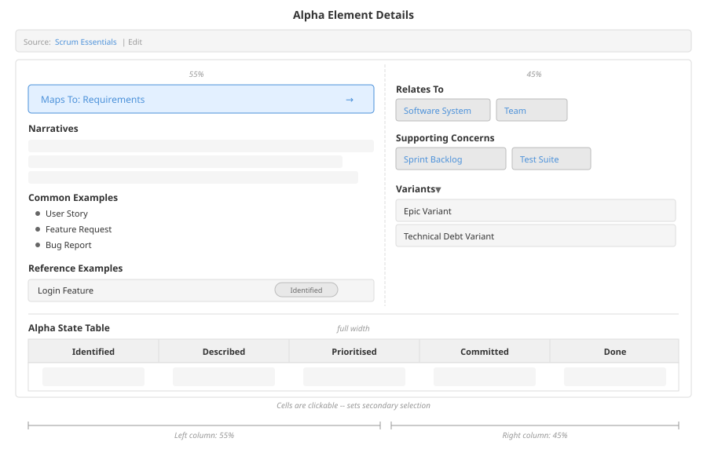

Two-column layout:

- **Left column (55%):**
  - MapsTo parent tile (if the alpha maps to another alpha) -- clickable, navigates to the parent alpha.
  - Narratives.
  - Common examples -- Alpha instances matching this alpha, rendered as a bulleted list.
  - Reference examples -- Curated reference instances with state attribution, descriptions, evidence links, and work product cross-references.

- **Right column (45%):**
  - Relates To -- Clickable buttons showing related alphas with relationship type, direction arrow, and description. Toggles secondary panel.
  - Supporting Concerns -- Clickable buttons listing alphas that contribute to this alpha. Opens secondary panel.
  - Variants (collapsible) -- Alpha variants with icons and descriptions.

- **Full width (below columns):**
  - Alpha State Table -- A tabular progression view (see "Alpha State Table" below).

#### Activity Space

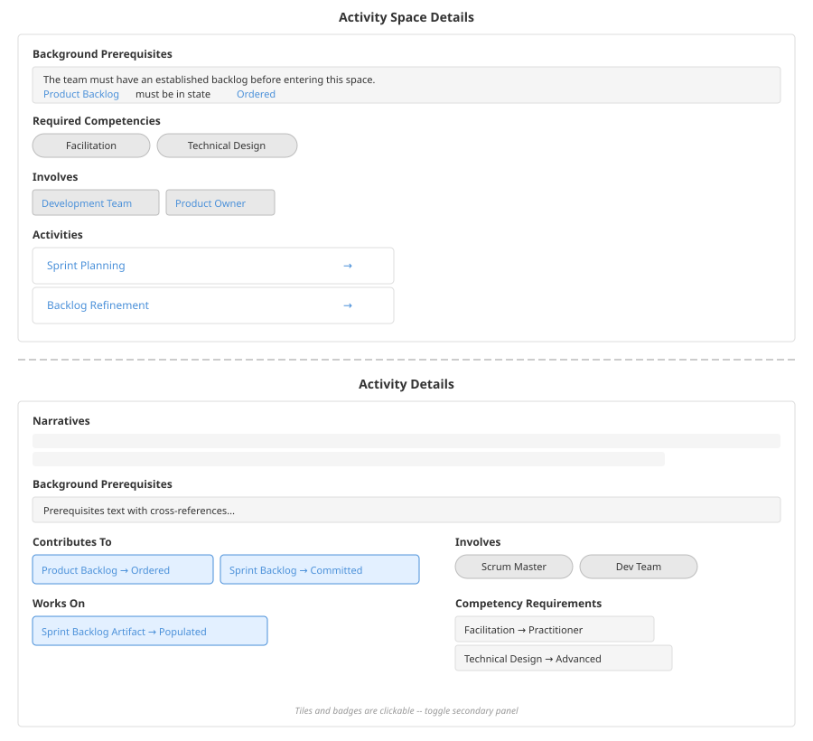

- Background prerequisites (rendered as a structured block with navigable cross-references).
- Required competencies (badge list).
- Involves (persona groups as clickable buttons opening secondary panel).
- Activities list -- Clickable cards for each activity, opening the secondary panel.
- Narratives when present.

#### Activity

- Narratives.
- Background prerequisites.
- Verification test (rendered as a structured test block).
- Examples (rendered as structured example blocks).
- Contributes To -- Clickable tiles showing `alphaName -> stateName` pairs. Uses the `alphaName::stateName` compound key format. Toggles secondary panel.
- Works On -- Clickable tiles showing `workProductName -> levelOfDetailName` pairs. Uses the `workProductName::levelOfDetailName` compound key format. Toggles secondary panel.
- Involves -- Persona group name badges.
- Competency requirements -- Either recommended competency levels (`competencyName -> competencyLevelName`) or required competencies (name only).

#### Work Product

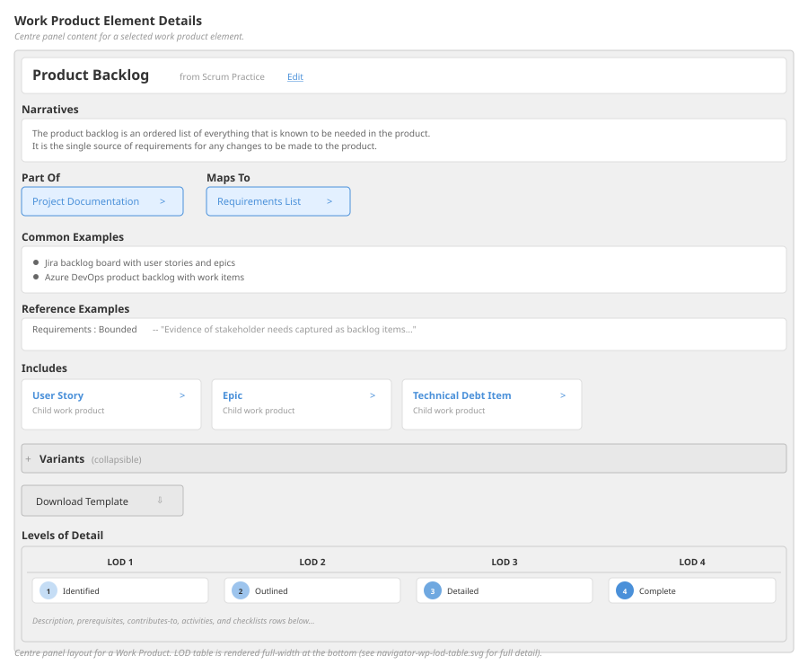

- Narratives.
- Part Of link (if this work product is a child of another) -- clickable, navigates to the parent work product.
- Maps To link (if this work product maps to another) -- clickable.
- Common examples -- Work product instances matching this work product.
- Reference examples -- Evidence entries from practice references that cite this work product, with source alpha attribution.
- Includes -- Child work products (those declaring `partOf` this work product), rendered as clickable cards that navigate to the child.
- Variants (collapsible) -- Work product variants with icons and descriptions.
- Download template button -- Generates and downloads a Markdown template derived from the work product's practice definition. Available only for flat-store documents.
- Work Product LOD Table -- A tabular progression view (see "Work Product LOD Table" below).

#### Pattern

- Concern instances (collapsible) -- Alpha instance names with descriptions.
- Work product instances (collapsible) -- Work product instance names with descriptions.
- Pattern Table (full width) -- A matrix view (see "Pattern Table" below).

#### Persona Group

- Narratives.
- Personas -- Clickable buttons for each persona in the group, filtered by `personaNames`. Toggles secondary panel.

#### Persona

- Narratives.
- Competencies -- Clickable badges showing `competencyName -> competencyLevelName`. Toggles secondary panel to show the competency.

#### Competency

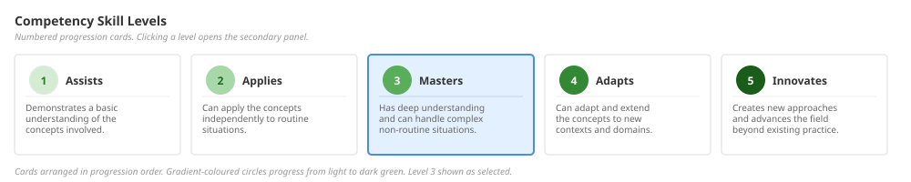

- Narratives.
- Skill Levels -- Numbered progression cards sorted by level number. Each card shows a gradient-coloured circle with the level number, the level name, and a description. Colour progresses through a hue gradient. Clickable to toggle secondary panel.

---

## Secondary Details Panel

The right panel (320px) provides contextual drilldown for sub-elements of the primary selection. It is sticky-positioned, spans full viewport height, and scrolls independently.

### Common Chrome

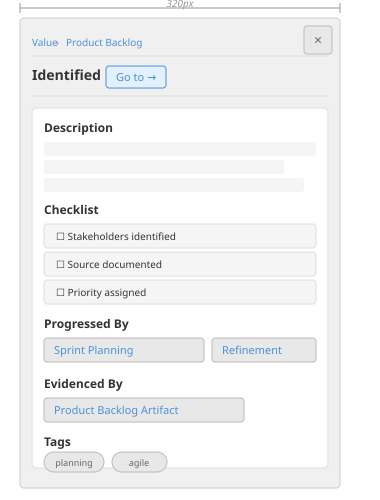

All secondary views include:
- **Close button** -- Clears the `secondary` URL parameter, collapsing the panel.
- **Breadcrumb parent links** -- Navigable links back to the parent element.
- **Title with "Go to" arrow** -- The element name, accompanied by a navigation arrow that atomically sets `selected` to this element and clears `secondary` (promoting the secondary element to primary).

### Content by Secondary Type

#### State

- Narratives.
- Contributes-to-state references.
- Background prerequisites.
- Checklist items with verification criteria, evidence descriptions, and test scenarios.
- Progressed-by activities -- Rendered as chevron-shaped indicators showing which activities advance this state.
- Evidenced-by work products -- Work products and LODs that provide evidence for this state.
- Tags.

#### Activity

- Narratives.
- Contributes To tiles (alpha state references).
- Works On (work product LOD references).
- Involves (persona groups).
- Competency requirements.
- Background prerequisites.
- Verification test.
- Examples.
- Tags.

#### Work Product

- Part Of link (navigable to parent work product).
- Levels of Detail with their contributes-to references.
- Background prerequisites.
- Checklist items.
- Tags.

#### Level of Detail

- Narratives.
- Contributes To references.
- Background prerequisites.
- Checklist items with evidence descriptions.

#### Pattern View

- Concern states reached in this view.
- Activity spaces involved.
- Activities performed.
- Concern instances participating.

#### Alpha (as secondary)

- States rendered as numbered progression cards (same gradient-circle style as competency levels).

#### Practice (from introduction context)

- Description and narratives.
- Tags.
- "Go to" button for navigating to the practice in the library.

#### Persona

- Narratives.
- Competency references as navigable buttons.

#### Competency

- Narratives.
- Skill levels as numbered progression cards.

#### Competency Level

- Parent competency name.
- Narratives.
- Tags.

---

## Element Resolution

The navigator uses an ordered resolution strategy to map element names (from URL parameters) to typed element data. The primary and secondary resolutions follow different rules.

### Primary Element Resolution

The `selected` parameter is resolved by searching element collections in the following order. The first match wins.

1. **Special values:** `__introduction__`, `__references__`, `__overview__` -- matched literally.
2. **Patterns** -- Searched by `name`.
3. **Work products** -- Searched by `name`. Supports the compound format `workProductName::lodName` to select a work product with a specific level of detail pre-focused.
4. **Persona groups** -- Searched by `name`.
5. **Personas** -- Searched by `name`.
6. **Competencies** -- Searched by `name`.
7. **Alphas** -- Searched across all focus groups by `name`.
8. **Activity spaces and activities** -- Searched across all focus groups. Activity spaces by `name`, then activities nested within each space by `name`.

### Secondary Element Resolution

The `secondary` parameter is resolved contextually based on the primary element's type. The resolution rules check context-specific collections first, then fall through to broader searches.

| Primary Type    | Secondary Can Be |
|-----------------|------------------|
| Overview        | Alpha, activity space, or activity (searched across all focus groups) |
| Alpha           | State (within the alpha), related alpha (from `baseline.alphas`), or activity |
| Activity Space  | Activity (within the space) |
| Work Product    | Level of detail (within the work product) |
| Pattern         | Pattern view (within the pattern), or alpha |
| Introduction    | Practice document (lazily fetched and cached) |
| Persona Group   | Persona (from the group's `personaNames`), or competency |
| Persona         | Competency (from the persona's `competencies` references) |
| Competency      | Competency level (within the competency) |

**Cross-reference format:** The compound format `alphaName::stateName` is parsed for cross-references from activities and work products. When a secondary element name contains `::`, it is split and the first part is matched as an alpha name, the second as a state name within that alpha.

**Fallback resolution:** After context-specific checks, the resolver performs broader searches:
- Activities are searched across all focus groups (to support cross-references from alpha state tables and work product LOD tables).
- Work products are searched across the baseline (to support references from activities).

---

## User Interactions

### Navigation Flow

1. User arrives at the navigator route with document parameters (`libraryId` or `bundle`/`path`).
2. The document is fetched from the appropriate API endpoint.
3. If the document declares dependencies (baseline practice or practice dependencies), library resolution is triggered to produce a fully composed view.
4. Default view: `selected=__introduction__`, `secondary=null`.
5. User clicks sidebar items to update `selected` -- centre panel content changes.
6. User clicks sub-elements within the centre panel to update `secondary` -- right panel appears, grid expands from 2 to 3 columns.
7. User clicks the "Go to" arrow in the secondary panel -- `selected` is atomically set to the secondary element's name and `secondary` is cleared. Grid contracts back to 2 columns.
8. User clicks the close button in the secondary panel -- `secondary` is cleared. Grid contracts.

### Auto-Mode Switching

When a user selects an element whose type does not match the current mode, the mode automatically switches:
- Selecting an alpha while in "activities" mode switches to "concerns".
- Selecting an activity or activity space while in "concerns" mode switches to "activities".

This ensures the sidebar tree remains consistent with the currently viewed element.

### Selection Toggle

Many sub-element buttons in the centre panel act as toggles: clicking an already-selected secondary element clears the selection (closes the secondary panel). A dismiss icon (x) appears on selected items to indicate this affordance.

---

## Integration Points

### Document Loading

The navigator fetches documents from two API endpoints depending on the source:
- **Flat store:** `GET /api/documents/{id}` -- Returns the document by its flat-store identifier.
- **Bundle library:** `GET /api/library/document?bundle={slug}&path={path}` -- Returns a document from a registered bundle.

### Dependency Resolution

When the loaded document declares practice dependencies, the navigator uses the `resolve-for-render` hook to:
1. Recursively resolve all practice dependencies.
2. Compose the full baseline through the merge algorithm.
3. Produce a dependency diagram layout for the introduction view.
4. Collect version warnings and schema compatibility warnings.

### Practice Library Lookups

The element details panel fetches practice library identifiers on mount to enable "edit" links from the source practice attribution. It queries both:
- `GET /api/documents?details=1` -- Flat-store document listing.
- `GET /api/library/index` -- Bundle library index.

### Static Site Export

The introduction view offers a download button that triggers:
- **Flat store:** `GET /api/documents/{id}/static-site`
- **Bundle library:** `GET /api/library/static-site?bundle={slug}&path={path}`

These endpoints generate a ZIP archive containing markdown pages and SVG overview diagrams.

### Work Product Template Download

The work product detail view offers a template download button that triggers:
- `GET /api/documents/{id}/work-product-template?wp={workProductName}`

This generates a Markdown template derived from the work product's practice definition.

### Alpha and Activity Scores

The navigator pre-fetches alpha scores and activity space scores (server-side cached analysis data) to populate the overview diagrams. These are loaded in parallel with the document fetch and passed to the overview diagram renderer.

### Element Aliasing

The navigator wraps its content in an alias provider that reads `practiceElementAliases` from the source document. All element names throughout the navigator are rendered through the aliasing layer, which can substitute display names without changing the underlying element identifiers.

### Alpha State Table

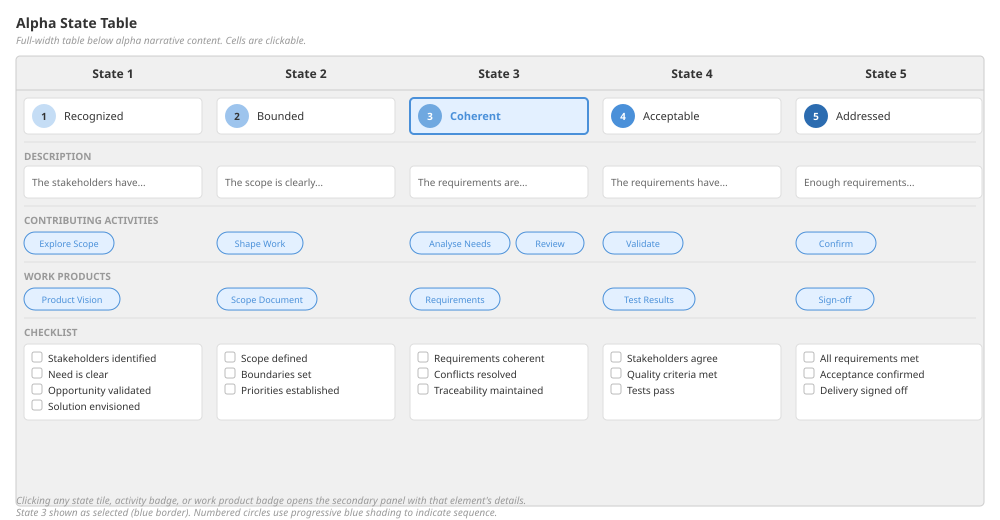

A full-width table rendered below the alpha's narrative content. Structure:
- **Columns:** One per state, sorted by sequence number.
- **Rows:** State name tiles (with numbered colour circles), description, activities that contribute to this state, work products whose LOD contributes to this state, and checklist items.
- **Interaction:** Cells are clickable, setting the clicked element as the secondary selection.

### Work Product LOD Table

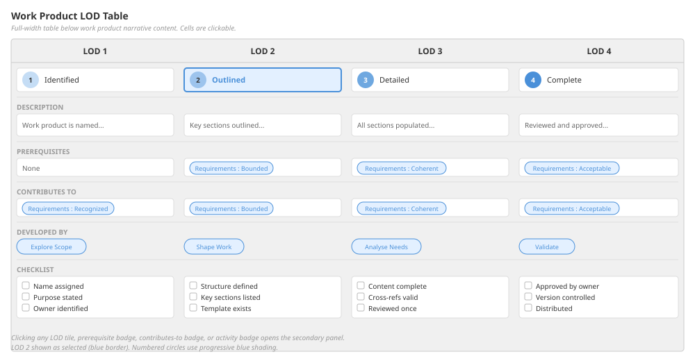

A full-width table rendered below the work product's narrative content. Structure:
- **Columns:** One per level of detail.
- **Rows:** LOD name tiles, description, prerequisites, contributes-to references, developed-by activities, and checklist items.
- **Interaction:** Cells are clickable, setting the clicked element as the secondary selection.

### Pattern Table

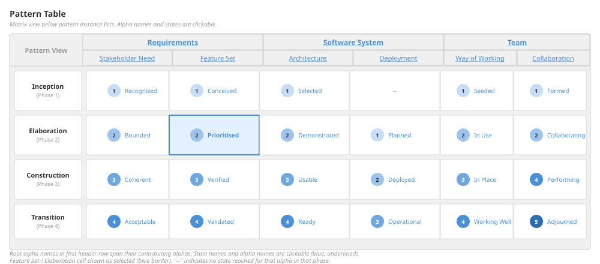

A matrix view rendered below the pattern's instance lists. Structure:
- **Rows:** Pattern views (stages of the pattern).
- **Column groups:** Alpha hierarchies. Root alphas span their contributing alphas as a two-row header -- root alpha in the first header row, individual alphas in the second.
- **Cells:** Show the states reached by each alpha in each pattern view.
- **Interaction:** Alpha names and states are clickable, opening the secondary panel. Alpha clicks use the "alpha" mode context for auto-mode switching.
