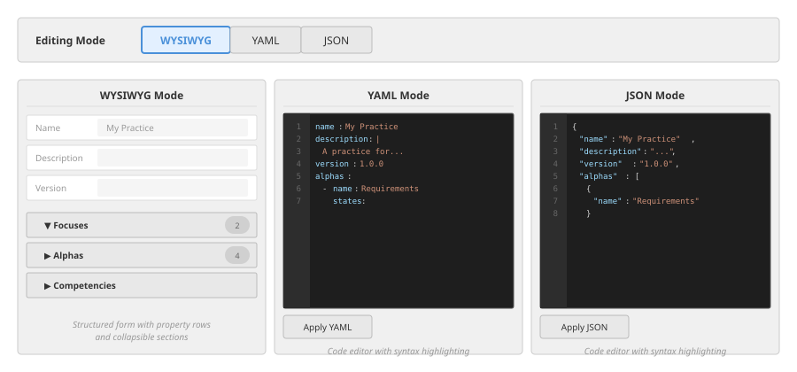
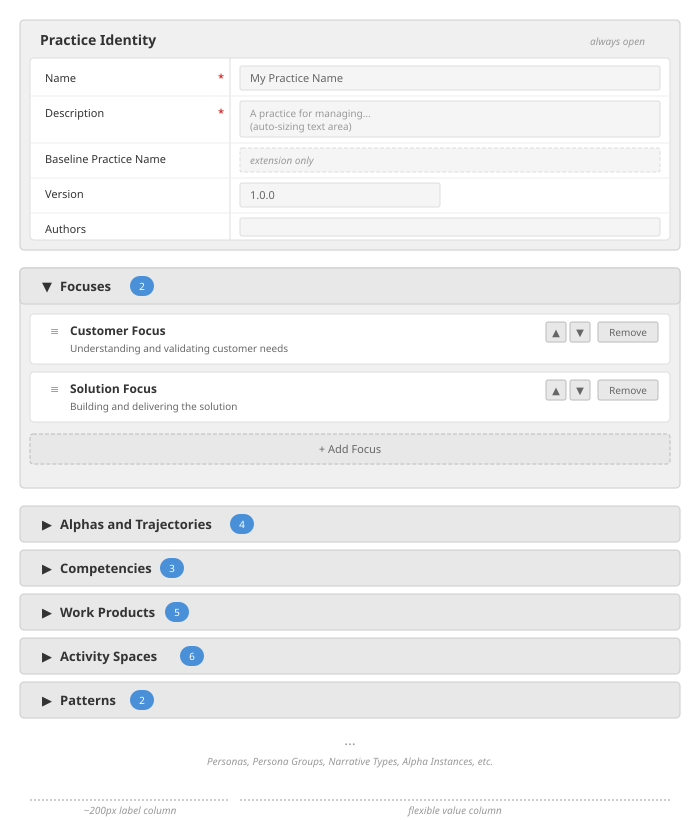
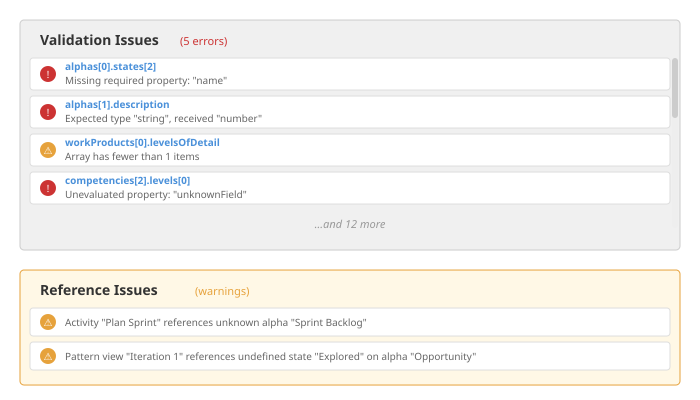
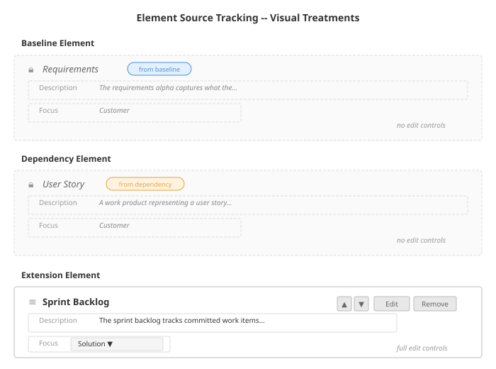

# Practice Author

## Purpose

The Practice Author is a multi-mode editor for creating and editing practice and baseline documents. It provides three complementary editing modes -- a structured form editor (WYSIWYG), a YAML text editor, and a JSON text editor -- allowing authors to work at the abstraction level most appropriate to the task. The WYSIWYG mode presents domain-specific field editors that enforce structural conventions, while the text modes offer unrestricted access to the full document for power users who prefer to work directly with the underlying data.

The Practice Author supports the full document lifecycle: creating new documents, loading existing ones from the library, saving, branching via save-as, reverting local changes, and discarding back to the persisted version. It is the primary write interface in the system -- the counterpart to the Practice Navigator's read-only exploration view.

---

## Editing Modes

Three editing modes are available, selected via a toggle group in the toolbar. The active mode determines which editor panel is rendered.

### WYSIWYG Mode (Default)

A structured form editor composed of domain-specific field editors organized into collapsible sections. Each field edit produces an immutable document update by path string (e.g., `alphas[2].states[0].name`), yielding a new document object with only the modified branch cloned. The original document is never mutated.

### YAML Mode

A code editor with YAML syntax highlighting, folding, and inline syntax validation. The editor operates on a YAML text draft that is independent of the document object. Changes to the text draft do not affect the document state until the author explicitly commits by pressing "Apply YAML", which parses the YAML to JSON, replaces the document state, infers the document kind, marks the document as dirty, and triggers validation.

### JSON Mode

A code editor with JSON syntax highlighting, folding, and inline syntax validation. Operates identically to YAML mode but on a JSON text draft. An "Apply JSON" action parses the text and commits it to the document state.

### Mode Switching

Switching between modes requires a successful commit of the current mode's state:

- **Leaving a text mode:** The current text draft must parse successfully. If parsing fails, the mode switch is aborted and the author remains in the current mode.
- **Entering a text mode:** The current document state is serialized to the target format (JSON or YAML) and loaded into the text draft.
- **Entering WYSIWYG mode:** No serialization is needed -- the WYSIWYG editor reads directly from the document state.

Mode switching is therefore a two-step operation: commit the outgoing mode, then initialize the incoming mode.

---

## Document Lifecycle

### Document Kind Inference

The system infers the document kind from its content rather than requiring explicit selection:

- If the document declares a `baselinePracticeName`, it is classified as an **extension** practice.
- Otherwise, it is classified as a **baseline** practice.

Kind inference runs on every document state change and determines which WYSIWYG sections are shown, which validations apply, and how the document is saved.

### Create (New Document)

When the Practice Author is opened without a library identifier:

1. A new empty document is initialized with default values. Extension defaults include empty arrays for all element collections and pre-set schema version and date fields.
2. The document is displayed in the editor with no library association.
3. On first save, the document is submitted as a new creation request with title, kind, and body.
4. The system returns a library identifier, and the editor's URL is updated to include it, establishing a persistent library session.

### Load (Existing Document)

When the Practice Author is opened with a library identifier in the URL:

1. The document is fetched from the storage layer by identifier.
2. The response populates both the working document state and a snapshot of the "original" state (used for revert).
3. The dirty flag is reset to false.
4. Both text drafts (JSON and YAML) are re-serialized from the loaded state.
5. Validation runs automatically against the loaded content.
6. If the URL specifies a preferred editor mode, the editor opens in that mode and the URL parameter is stripped.

### Save

Saves the current document to the library under its existing identifier:

1. The body is resolved from the current editing mode -- for text modes, the draft is parsed first (and save fails if parsing fails).
2. The document is submitted as an update request with the body.
3. On success, the working state, original snapshot, and all text drafts are synchronized.
4. The dirty flag is reset to false.

If no library identifier exists (new document that has never been saved), save falls through to the create flow.

### Save As

Always creates a new document, regardless of whether a library identifier exists:

1. The document is submitted as a new creation request.
2. The editor navigates to the newly created document (adds a history entry, unlike the create flow which replaces the current entry).

### Revert

Restores the working document to the last-loaded state:

1. A confirmation dialog is shown.
2. On confirmation, the document state is reset to the "original" snapshot.
3. All text drafts are re-serialized.
4. Validation re-runs.
5. The dirty flag is reset to false.

### Discard

Re-fetches the document from the storage layer, discarding all local changes including any that were committed from text modes:

1. If the document is dirty, a confirmation dialog is shown.
2. On confirmation, the document is re-fetched from the API.
3. The full local state is reset, including both text drafts.
4. The editor mode is forced back to WYSIWYG, regardless of which mode was active.

### Dirty Tracking

A boolean dirty flag tracks whether the document has diverged from its persisted state. The flag is set to true on any document change (WYSIWYG field edits, text mode commits) when a library session is active. It is reset to false on successful save, revert, or discard. When dirty, an "Unsaved" indicator is displayed in the editor header.

---

## WYSIWYG Editor Sections

The WYSIWYG editor renders the document as a vertical stack of collapsible sections. Each section corresponds to a top-level element collection in the practice schema. The order below is the rendering order; some sections are conditional on the document kind.

### 1. Practice Identity

Top-level metadata fields, rendered as a property table (not collapsible):

| Field | Type | Notes |
|-------|------|-------|
| Name | Single-line text | Required |
| Description | Auto-sizing text area | Required |
| Baseline Practice Name | Single-line text | Extension only |
| Practice Dependencies | Dependency table | Extension only; references to other practice names |
| Version | Single-line text | |
| Authors | Multi-line text (one per line) | |
| Keywords | Multi-line text (one per line) | |
| Created | Single-line text | Date |
| Updated | Single-line text | Date |

### 2. Focuses

Repeating array of focus elements. Each focus card contains:

- Name, Description
- Tags (structured, three-bucket)
- Narratives (with nested narrative contexts)

### 3. Alphas and Trajectories

Repeating array of alpha elements, each containing nested sub-arrays:

- **Alpha level:** Name, Description, Focus (dropdown of available focuses), Tags, Narratives
- **States** (nested repeating array): Name, Description, Tags, Narratives
  - **Checklist Items** (nested within each state): Name, Description, with move and remove actions

Baseline-sourced alphas and their states are rendered as read-only (see Source Tracking).

### 4. Competencies

Repeating array of competency elements, each containing:

- **Competency level:** Name, Description, Tags, Narratives
- **Levels** (nested repeating array): Name, Description, Tags, Narratives

### 5. Work Products

Repeating array of work product elements, each containing:

- **Work product level:** Name, Description, Tags, Narratives
- **Levels of Detail** (nested repeating array): Name, Description, Tags, Narratives

### 6. Activity Spaces

Repeating array of activity space elements, each containing:

- **Activity space level:** Name, Description, Focus (dropdown), Tags, Narratives
- **Activities** (nested repeating array): Name, Description, Tags, Narratives

For baseline documents, activities are embedded within their parent activity spaces.

### 7. Baseline Activity Spaces (Extension Only)

A read-only reference display of activity spaces inherited from the resolved baseline. Shown only when the document is an extension practice and a baseline has been successfully resolved. These elements are not editable.

### 8. Activities (Extension Only)

A flat repeating array of activities, displayed only for extension practices. Unlike baseline activity spaces (where activities are nested), extension activities are defined at the top level with explicit references to their parent structures:

| Field | Type |
|-------|------|
| Name | Single-line text |
| Description | Auto-sizing text area |
| Activity Space Name | Dropdown (available activity spaces) |
| Focus | Dropdown (available focuses) |
| Contributes To | Alpha contributions table (alpha + state pairs) |
| Required Competencies | Multi-line text (one per line) |
| Involves | Multi-line text (one per line) |
| Recommended Competency Levels | Competency level references table |
| Works On | Work product contributions table |
| Tags | Structured tags editor |
| Narratives | Narratives editor |

### 9. Patterns

Repeating array of pattern elements, each containing:

- **Pattern level:** Name, Description, Narrative Type (dropdown), Tags, Narratives
- **Pattern Views** (nested repeating array): Name, Description, Alpha States, Alpha Instances, Activity Spaces, Activities, Narrative Contexts, Tags, Narratives

### 10. Personas

Repeating array of persona elements. Each card contains:

- Name, Description, Competencies, Tags, Narratives

### 11. Persona Groups

Repeating array of persona group elements. Each card contains:

- Name, Description, Persona Names (multi-line), Tags, Narratives

### 12. Narrative Types

Repeating array of narrative type elements, each containing:

- **Narrative type level:** Name, Description, Tags, Narratives
- **Narrative Elements** (nested repeating array): Name, Description, How to Use, Tags, Narratives

### 13. Alpha Instances (Extension Only)

Repeating array of alpha instance elements. Each card contains:

- Instance Name (dropdown of available instance names), Alpha Name (dropdown), State Name (dependent dropdown filtered by selected alpha), Name, Description, Tags, Narratives

### 14. Work Product Instances (Extension Only)

Repeating array of work product instance elements. Each card contains:

- Instance Name (dropdown), Work Product Name (dropdown), Level of Detail Name (dependent dropdown filtered by selected work product), Name, Description, Tags, Narratives

### Section Container Behaviour

All repeating sections share a common container pattern:

- **Collapsible:** Each section can be expanded or collapsed. Sections auto-expand when the total item count is small (eight or fewer items).
- **Add:** An "Add" button appends a new element with default values to the array.
- **Remove:** Each item card has a remove button. Removal triggers sequence renumbering.
- **Move Up / Move Down:** Items can be reordered within their array. Move buttons are disabled at array boundaries.
- **Sequence Renumbering:** After any add, remove, or move operation, all items in the array are assigned sequential `seq` values (1, 2, 3, ...) based on their current position.
- **Readonly Items:** Items sourced from a baseline or dependency are visually dimmed, display a lock icon, and suppress edit/move/remove controls.

### Shared Sub-Fields

Nearly every element type includes two shared sub-field groups:

- **Tags:** A structured tag editor with three categories -- domain, lifecycle, and organizational. Each tag is a type-value pair editable via a type dropdown and a value text input. Tags can be added, removed, and reordered.
- **Narratives:** An array of narrative cards, each with a name, description, narrative type selector (populated from available narrative types across baseline, dependencies, and current document), and nested narrative contexts. Narrative contexts are filtered to show only the narrative elements defined by the selected narrative type, and display the element's "how to use" guidance inline.

---

## Field Editor Types

The WYSIWYG editor is composed from a library of reusable field editors, organized into three categories.

### Base Fields

| Field | Behaviour |
|-------|-----------|
| **Single-Line Text** | Standard text input with minimal chrome (transparent border, highlighted on focus). |
| **Auto-Sizing Text Area** | Multi-line text input that expands vertically as content grows, based on line count. Configurable minimum row count. |
| **Dropdown Select** | Selection from a list of options. If the current value is not present in the options list, it is added with a "not found in library" suffix to prevent silent data loss. Optionally allows an empty selection. |
| **Property Table** | Bordered container that wraps property rows into a visual group. Supports an optional title. |
| **Property Row** | Two-column grid layout (fixed-width label, flexible-width value). Displays a required-field marker when the field is mandatory. Shows a lock icon when the field is read-only. Supports full-width mode where the value spans both columns. |

### Domain-Specific Fields

| Field | Behaviour |
|-------|-----------|
| **Tags** | Structured tag editor with three categories (domain, lifecycle, organizational). Each tag is a type-value pair with a type dropdown and value input. Supports add, remove, and reorder. Normalizes legacy flat-string tag formats on load. |
| **Narratives** | Array of narrative cards. Each narrative has name, description, narrative type (dropdown populated from available types), and nested narrative contexts. Supports add, remove, and reorder of both narratives and their contexts. |
| **Narrative Contexts** | Table of sequenced narrative element references. Each row has a sequence number, a narrative element name (dropdown filtered to elements from the parent narrative's selected type), and a context text area. Displays the element's "how to use" guidance text inline as a hint. |
| **String Array** | Text area where each line maps to one array element. Used for simple lists like authors or keywords. |
| **Alpha Contributions** | Table of alpha-name / state-name pairs. State dropdown cascades based on the selected alpha -- only states belonging to the chosen alpha are available. |
| **Work Product Contributions** | Table of work-product-name / level-of-detail-name pairs. Level dropdown cascades based on the selected work product. |
| **Competency Level References** | Table of competency-name / competency-level-name pairs with cascading selection. |
| **Alpha Instances** | Table of instance references with name, alpha name, and state name (dependent dropdown). |
| **Practice Dependencies** | Table of practice name references with a selector drawn from available library practices. |
| **Citations** | Multi-field citation editor. Each citation has name, description, authors, date, and source fields. |
| **Notes** | Timestamped note entries with name, timestamp, and content. |
| **Team Members** | Team member entries with name, persona name (dropdown), and contact fields. |
| **Communication Channels** | Channel name and address pairs. |
| **Checklist States** | Checklist tracking with item name, status dropdown (complete / not complete / not required), and evidence URI. Includes an "Initialize from definition" button that populates the checklist from the element's schema definition. |

### Read-Only Fields

| Field | Behaviour |
|-------|-----------|
| **Inline Read-Only Value** | Displays a value in a dashed-border, italicized container with a source badge indicating the element's origin ("from baseline" or "from dependency"). Used when an element is locked due to source tracking. |
| **Labelled Read-Only Field** | A label-description-value group rendered in read-only style with source attribution. |

---

## Validation Flow

Validation runs continuously as the author edits. It is triggered automatically after every document state change -- WYSIWYG field edits, text mode commits, document load, revert, and discard.

### Two-Tier Schema Validation

Each validation request evaluates the document against the practice schema at two strictness levels:

1. **Strict validation:** Full schema enforcement including cardinality constraints (minimum item counts, required properties). A document that passes strict validation is considered structurally complete.

2. **Relaxed validation:** A modified schema with cardinality constraints removed (minimum item counts and minimum property counts stripped). A document that passes relaxed validation has correct types and structure but may be incomplete. This tier serves as the gate for rendering and export -- a document must pass at least relaxed validation to be displayed in the navigator or exported.

Both tiers collect all errors rather than stopping at the first failure.

### Validation Result

The validation endpoint returns four values:

| Field | Type | Meaning |
|-------|------|---------|
| `ok` | boolean | Strict validation passed |
| `issues` | array | Strict validation errors (path + message) |
| `relaxedOk` | boolean | Relaxed validation passed |
| `relaxedIssues` | array | Relaxed validation errors (path + message) |

### Display Logic

- If strict validation fails (`ok = false`): strict issues are displayed.
- If strict passes but relaxed fails (`ok = true`, `relaxedOk = false`): relaxed issues are shown as warnings.
- If both pass: no issues displayed.

Issues are displayed in a scrollable list, capped at a maximum count (eight) with an overflow indicator ("...and N more"). Each issue's JSON path (e.g., `/activities/0/name`) is formatted into a human-readable label (e.g., "Activity #1: name"). Error messages are enriched server-side -- unevaluated property errors include the property name, type errors include the expected type, and required-field errors include the missing property name.

### Reference Validation (Second Layer)

After schema validation, a reference integrity check runs for baseline documents. This builds internal indexes and detects broken cross-references -- for example, an activity that references a non-existent alpha, or a pattern view that references an undefined state. Reference issues are displayed in a separate warning panel, distinct from schema issues.

Reference integrity checking covers: focuses, alphas, alpha states, activity spaces, competencies, work products, levels of detail, patterns, pattern views, and persona groups.

---

## Source Tracking

When editing an extension practice, elements inherited from the baseline or from practice dependencies are tracked and displayed differently from elements defined in the extension itself.

### Element Source Types

| Source | Meaning |
|--------|---------|
| `baseline` | Element originates from the resolved baseline practice |
| `extension` | Element is defined in the current extension document |
| `dependency` | Element originates from a resolved practice dependency |

### Source Map Construction

An element source map is built when the document is classified as an extension practice and a resolved baseline is available. The map uses semantic dot-paths as keys (e.g., `alphas.Solution`, `alphas.Solution.states.In Use`, `alphas.Solution.states.In Use.checklist.Item Name`).

The map is populated in two passes:

1. **Baseline pass:** All baseline elements are registered with their full path hierarchies -- alphas and their descriptions, focus associations, states, checklist items, narratives; focuses; activity spaces and their activities; competencies and their levels; work products and their levels of detail (including nested checklist items and narratives); narrative types and their narrative elements (including how-to-use text); personas; persona groups; patterns and their pattern views.

2. **Dependency pass:** Dependency elements are registered similarly, but only for paths not already claimed by the baseline. Baseline attribution takes precedence over dependency attribution.

### Display Behaviour

- **Baseline elements:** Displayed as read-only with a lock icon. Edit, move, and remove controls are suppressed. Field values render through the inline read-only field editor with a "from baseline" source badge.
- **Dependency elements:** Same visual treatment as baseline elements, with a "from dependency" source badge.
- **Extension elements:** Fully editable with all controls available.

### Granular Tracking

Source tracking operates at multiple levels of granularity:

- **Element level:** An alpha sourced from the baseline is entirely read-only.
- **Sub-element level:** Individual states within an alpha can be independently tracked -- a baseline alpha may have both baseline states (read-only) and extension states (editable).
- **Property level:** Individual properties like description and focus assignment can be tracked, allowing fine-grained control over which parts of an inherited element can be modified.

---

## User Interactions

### Creating a New Practice

1. Author opens the Practice Author with no library identifier.
2. An empty document is initialized with default values.
3. Author fills in the practice identity fields (name, description).
4. If authoring an extension, author sets the baseline practice name. The system infers the document kind and adjusts the available sections.
5. Author populates element sections as needed, adding alphas, states, activities, etc.
6. Validation runs continuously, showing issues as they arise.
7. Author saves the document. The system creates a new library entry and updates the URL.

### Editing an Existing Practice

1. Author opens the Practice Author with a library identifier.
2. The document is fetched and loaded into the editor.
3. Author modifies fields. Each change updates the document immutably and triggers validation.
4. The dirty indicator appears in the header.
5. Author saves when satisfied. The dirty indicator clears.

### Switching to a Text Mode for Bulk Edits

1. Author is working in WYSIWYG mode and clicks the YAML or JSON toggle.
2. The current document state is serialized to the target format and loaded into the text editor.
3. Author edits the text directly.
4. Author clicks "Apply YAML" or "Apply JSON" to commit changes.
5. If the text parses successfully, the document state is updated, kind is re-inferred, and validation runs.
6. If parsing fails, the error is displayed inline and the text draft remains for correction.

### Recovering from Unwanted Changes

- **Revert:** Author clicks Revert, confirms the dialog, and the document resets to the last-loaded snapshot. Useful when the author wants to undo all changes since the last save or load.
- **Discard:** Author clicks Discard, confirms the dialog, and the document is re-fetched from the server. Useful when the author suspects the local state has diverged from the persisted state. The editor is forced back to WYSIWYG mode.

### Working with Inherited Elements

1. Author opens an extension practice that declares a baseline practice name.
2. The system resolves the baseline and builds the element source map.
3. Baseline-sourced elements appear with lock icons and read-only fields.
4. Author can view inherited element values but cannot modify them.
5. Author adds new extension elements alongside inherited ones. New elements are fully editable.
6. Inherited checklist items within a state are displayed as locked rows. The author can add new extension checklist items below them.

### Branching a Document

1. Author loads an existing document.
2. Author clicks "Save As".
3. A new library entry is created with the current document content.
4. The editor navigates to the new document, which is now an independent copy.

---

## Integration Points

### Storage Layer

The Practice Author interacts with the document storage API for all persistence operations:

| Operation | Endpoint | Payload |
|-----------|----------|---------|
| Create | `POST /api/documents` | `{ title, kind, body }` |
| Load | `GET /api/documents/{id}` | -- |
| Save | `PUT /api/documents/{id}` | `{ body }` |
| Save As | `POST /api/documents` | `{ title, kind, body }` |
| Discard | `GET /api/documents/{id}` | -- (re-fetch) |

### Validation API

All validation is performed server-side via `POST /api/validate`, which accepts the full document body and returns the two-tier validation result. The Practice Author does not perform client-side schema validation.

### Library Resolution

On mount, the Practice Author fetches all library documents to support:

- **Baseline resolution:** Resolving the baseline practice name to a full baseline document, enabling source tracking and read-only field rendering.
- **Dependency resolution:** Resolving practice dependency names to their documents.
- **Name extraction:** Building lists of available element names (alphas, states, focuses, activity spaces, competencies, work products, etc.) for dropdown population throughout the WYSIWYG form.

### Practice Navigator

The Practice Author and Practice Navigator are complementary interfaces to the same document model. The Practice Author provides the write path; the Practice Navigator provides the read path. Documents saved through the Practice Author are immediately available in the Navigator, and the Navigator can link back to the Practice Author for editing.

### Narrative Type Awareness

The WYSIWYG editor merges narrative types from three sources -- the resolved baseline, resolved dependencies, and the current document -- into a single set of available types. This merged set populates the narrative type dropdown in the Narratives field editor and controls which narrative elements are available in the Narrative Contexts field editor.

### Element Default Factories

When adding new elements via the section "Add" button, the system uses element factory functions that produce schema-conformant defaults. Some factories enforce schema minimums: a new alpha is initialized with a minimum number of starter states, a new work product with a minimum number of levels of detail, and a new competency with a minimum number of levels. These defaults ensure that newly added elements pass relaxed validation immediately.
