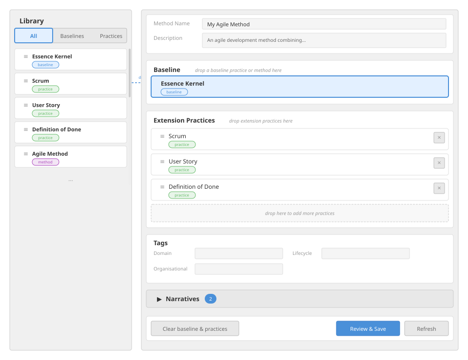
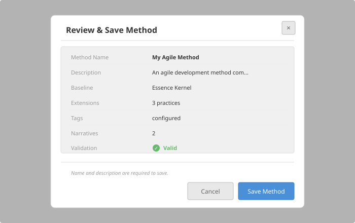

# Method Builder

## Purpose

The method builder enables users to compose methods by assembling a baseline practice with extension practices. A method is a concrete, deployable configuration of practices -- it selects one baseline (the kernel) and layers extension practices on top to specialise or augment the baseline's elements. The builder provides a drag-and-drop composition surface, a library panel for selecting source documents, and a save workflow that persists the method as a lightweight document containing only symbolic name references.

The method builder supports two entry modes: composing a new method from scratch (empty state), or editing an existing saved method loaded from the library via a document identifier in the URL query string. When editing, the builder resolves the method's symbolic references back into displayable slots and allows the user to modify the composition before saving an update.

---

## Composition Model

### Method Payload

A saved method document contains symbolic references rather than embedded practice bodies. This keeps the stored document lightweight and ensures that composition always uses the latest library versions at resolution time.

```
Method
  kind              : "method" (literal)
  name              : string (required)
  description       : string (required)
  baselinePracticeName : string        -- symbolic name of the baseline practice
  practiceNames     : string[]         -- symbolic names of extension practices (ordered)
  tags              : MethodTags       -- optional structured tag buckets
  narratives        : Narrative[]      -- optional method-level narrative prose
```

```
MethodTags
  domainTags        : string[]         -- optional
  lifecycleTags     : string[]         -- optional
  organizationalTags: string[]         -- optional
```

```
Narrative
  name              : string
  narrativeTypeName : string           -- optional; links to a baseline narrative type
  narrativeContexts : NarrativeContext[]
```

When the method document is resolved for rendering (e.g. in the practice navigator or for export), the symbolic names are looked up in the library and the full merge algorithm produces a single composite practice-shaped document. The method document itself never stores embedded practice bodies.

### Library Panel

The library panel lists all documents available in the library -- baselines, extension practices, and methods -- as draggable items. Documents are fetched from two sources in parallel: the flat document store (via the documents API with enriched detail fields) and the bundle library index. Bundle-only entries (those not duplicated in the flat store) are synthesised with a synthetic identifier of the form `bundle:<slug>/<path>`.

The panel provides three filter tabs:

| Tab | Documents shown |
|---|---|
| All | Every library document (baselines, practices, methods) |
| Baselines | Baseline practices and methods (both can supply a baseline) |
| Practices | Extension practices only |

Each library item displays its name, its document type extension, and a drop-target hint ("baseline slot" for baselines/methods, "extensions" for practices).

### Baseline Slot

The baseline slot accepts exactly one baseline at a time. When a document is dropped:

1. **Baseline practice document:** The baseline is extracted and placed directly into the slot.
2. **Method document:** The method's baseline is extracted (either from an embedded `baselinePractice` or resolved from `baselinePracticeName` via the library). The method's extension practices are also extracted and placed into the extension practices slot, aligned to the baseline name.

Dropping a new baseline replaces the current baseline. All existing extension practices are re-aligned to the new baseline's name via `practiceWithBaselineName()`, which updates each extension's `baselinePracticeName` field to match. Clearing the baseline also clears all extension practices and narratives.

### Extension Practices Slot

The extension practices slot accepts multiple extension practice documents and method documents. A baseline must be set before extensions can be added. When a document is dropped:

1. **Extension practice document:** The practice is added to the slot, aligned to the current baseline name. Duplicate practices (matching by library document identifier or by practice name) are rejected.
2. **Method document:** The method's extension practices are extracted (embedded layers via depth-first traversal, then `practiceNames` resolved from the library) and appended. Duplicates are skipped by name and by library identifier. The method's narratives are merged into the method-level narratives using additive narrative merge.

Extension practices are deduplicated by name: when incoming practices share a name with an existing slot entry, the incoming duplicate is silently skipped.

**Reordering:** Extension practices can be reordered via drag-and-drop within the slot. The reorder operation moves a practice from one position to another. The ordering determines merge precedence -- practices listed first are merged earlier and have higher precedence for non-description fields (descriptions always preserve the baseline/earlier layer's text).

**Removal:** Individual extension practices can be removed from the slot via a delete button.

### Baseline Alignment

Every extension practice in the slot has its `baselinePracticeName` field set to match the current baseline's name. This alignment happens:

- When a practice is first added to the slot.
- When the baseline is replaced (all existing practices are re-aligned).
- When practices are reloaded from the library during a refresh operation.

### Refresh from Library

The refresh operation reloads the baseline and all extension practices from the library using their most current versions. The resolution strategy is:

1. **Baseline:** If the baseline was loaded from a standalone library document, reload by that document's identifier. If the baseline was extracted from the method document being edited, attempt to find a standalone baseline library entry matching the baseline's symbolic name. If no standalone match exists, the embedded copy is retained.
2. **Extension practices:** If a practice was loaded from a standalone library document, reload by that document's identifier. If a practice was extracted from an embedded method (synthetic identifier), attempt to match by symbolic practice name against the library index, preferring the most recently updated entry when multiple documents share a name.

After reloading, if the method is being edited (has an existing document identifier), the method document is also auto-saved with the updated symbolic references.

---

## Merge Algorithm

The merge algorithm (`compositePracticeFromMethod`) takes a method and produces a single practice-shaped composite document. The algorithm proceeds in three phases: seeding, layered merge, and post-merge passes.

### Phase 1 -- Seed the Accumulator

```
function compositePracticeFromMethod(method, library):
    if method has embedded baselinePractice:
        baseline = clone(method.baselinePractice)
    else if method has baselinePracticeName and library is provided:
        baseline = findBaselineInLibrary(library, method.baselinePracticeName)
        if baseline is null:
            raise error "baseline not found"
    else:
        raise error "no baseline available"

    if library is provided:
        baseline = resolveBaselineWithDependencies(baseline, library)

    accumulator = new practice-shaped document seeded from baseline:
        name, description from method (not baseline)
        tags = union of method tags and baseline tags
        focuses, alphas, competencies from baseline (cloned)
        activitySpaces from baseline (converted to slot map)
        workProducts, patterns, personas, personaGroups from baseline
        narrativeTypes, citations, acknowledgements, assets from baseline
        narratives from method only (not baseline or practices)
```

The baseline seeds all element arrays. Each baseline alpha and work product is tagged with `sourcePracticeName` equal to the baseline's name for provenance tracking.

### Phase 2 -- Layered Extension Merge

Extension practices are collected from two sources in order:

1. Embedded `method.practices` (depth-first traversal of nested method aggregates).
2. Named `method.practiceNames` resolved from the library.

If the library is provided, transitive `practiceDependencyNames` on each practice are expanded in post-order (dependencies merge before dependents). The algorithm then walks the extension list:

```
for each item in extensionPractices:
    if item is an embedded method aggregate:
        merge its secondary baseline (if different from the primary)
        recursively merge its child practices
    else:
        merge the practice onto the accumulator
```

#### Element Merge Rules (`mergePracticeElementRecords`)

Elements from different layers are matched by **canonical name** -- case-insensitive, whitespace-normalised comparison. When two elements share a canonical name, they are merged field by field:

| Field type | Merge rule |
|---|---|
| `name` | Preserved from the base (earlier) layer |
| `description` | **Base always wins.** The earlier layer's description is authoritative and cannot be overridden by later layers. |
| `tags` | Union merge of tag arrays across all tag buckets |
| Scalar fields | Later layer fills only if base value is "vacant" (null, undefined, or empty string) |
| Named arrays | Merged by canonical name -- matching elements recurse with the same merge rules; new elements are appended |
| Unnamed arrays | Concatenated and deduplicated (by JSON equality for objects, by value for primitives) |
| `narrativeContexts` | Merged additively -- matched by `narrativeElementName::seq` key, prose is concatenated (not replaced) |
| `narratives` | Merged additively by name -- same-named narratives combine their contexts |
| `contributesTo` | Union of `{alphaName, stateName}` pairs (deduplicated by composite key) |

#### Specific Element Merge Functions

Each practice element type has a dedicated merge function that applies `mergePracticeElementRecords` plus type-specific handling:

- **`mergeAlphas`**: By canonical name. Merges states, supporting alphas (union of string lists), focus names (prefers non-implicit), and `contributesTo`/`mapsTo` relationships. Preserves `sourcePracticeName` from the earliest layer.
- **`mergeStates`**: By canonical name. Merges checklists. Sorted by `seq` after merge.
- **`mergeChecklists`**: By canonical name. Sorted by `seq` after merge.
- **`mergeFocuses`**: By canonical name. Standard element merge rules.
- **`mergeCompetencies`**: By canonical name. Merges competency levels by composite key (`level:name`), sorted by level number.
- **`mergeWorkProducts`**: By canonical name. Merges levels of detail (which themselves merge checklists). Preserves `sourcePracticeName`.
- **`mergePatterns`**: By canonical name. Merges pattern views (by name, sorted by `seq`). Pattern views merge activity space lists, activity lists, and alpha states/instances. Preserves `sourcePracticeName`.
- **`mergePersonas`**: By canonical name. Unions competency requirement lists (deduplicated by `competencyName::competencyLevelName`).
- **`mergePersonaGroups`**: By canonical name. Unions `personaNames` string lists.
- **`mergeNarrativesAdditive`**: By name. Same-named narratives combine via `mergePracticeElementRecords`. New narratives are appended.
- **`mergeNarrativeContextsAdditive`**: By `narrativeElementName::seq` composite key. Prose fields are concatenated across layers (not replaced). Non-prose fields follow standard element merge rules.
- **`mergeCitations`**: By canonical name. Unions author lists; later layer wins for date and source fields.
- **`mergeAssets`**: By canonical name. Later definition completely replaces earlier (atomic replacement, unlike citations).
- **`mergeAcknowledgements`**: By canonical name. Later layer wins for URL field.

#### Activity Space Merge

Activity spaces use a slot-map structure internally:

1. Each activity space is identified by a normalised identity key.
2. Activities within each space are identified by canonical name.
3. Spaces from the baseline seed the slot map; each extension practice's spaces merge into the map.
4. When two spaces share an identity key, their activities are merged by canonical name.
5. The final output preserves activity space ordering: baseline spaces first, then each extension's spaces in merge order, with duplicates resolved to their first occurrence.

Activity elements merge `contributesTo` (union), `requiredCompetencies` (union of string lists), `worksOn` (union), `recommendedCompetencyLevels` (union), and `focusName` (preferring non-implicit values).

### Phase 3 -- Post-Merge Passes

After all layers are merged, the following passes run in strict order:

1. **`applyAlphaBindings`**: Inject `contributesTo`/`mapsTo` relationships from `Method.bindings.alphaBindings`. For each binding, the target alpha and source alphas are matched by canonical name. If the relationship type is "variant", `mapsTo` is set on the source alpha; otherwise `contributesTo` is set. State-level contributions (`contributesToState`) are also injected. This pass must run before supporting-alpha aggregation so injected relationships are picked up.

2. **`applyWorkProductBindings`**: Inject `partOf`/`mapsTo` relationships from `Method.bindings.workProductBindings`. Same pattern as alpha bindings but for work products.

3. **`aggregateSupportingAlphasFromContributesTo`**: For every alpha that declares a `contributesTo` relationship pointing at another alpha, add the contributing alpha's name to the target alpha's `supportingAlphas` list (union with any explicit supporting alphas). This is how the rollup hierarchy is computed.

4. **`aggregateVariantsFromMapsTo`**: For every alpha that declares `mapsTo` pointing at another alpha, add the full alpha object to the target alpha's `variants` array. Unlike `supportingAlphas` (string names), `variants` holds full alpha objects for display. Variants do not participate in state rollup.

5. **`aggregateVariantsFromMapsToForWorkProducts`**: Same as above but for work products. Work products with `mapsTo` are added as variant objects on the target work product.

6. **`propagateDerivedFocusNames`**: Walk the element graph and propagate focus assignments from alphas to their associated activity spaces and activities. Elements without an explicit focus inherit from their nearest ancestor with a resolved focus.

7. **`finalizeImplicitFocusPlaceholders`**: Replace any remaining unresolved focus name placeholders (e.g. "Implicit focus") with the system default implicit focus name. This is the final fallback for elements that could not inherit a focus through propagation.

8. **`applyBaselineKernelPracticeDescriptions`**: Re-stamp the baseline's descriptions onto every same-named element in the merged output. This runs last to ensure that no intermediate clone or spread operation during earlier passes can leak extension-layer prose onto elements that are defined in the baseline. Covers all element types: focuses, alphas (and their states and checklists), activity spaces (and their activities), competencies (and their levels), narrative types (and their elements), patterns (and their views), work products (and their levels of detail and checklists), personas, and persona groups.

### Canonical Name Matching

All name-based matching uses canonical form:

```
function canonicalPracticeElementName(raw):
    if raw is not a string: return null
    trimmed = raw.trim()
    if trimmed is empty: return null
    return trimmed
        .toLowerCase()
        .replace(all whitespace runs with single space)
```

This ensures that "Requirements", "requirements", and "  Requirements  " all match the same element.

### Vacancy Detection

A scalar field is considered "vacant" when its value is `null`, `undefined`, or an empty/whitespace-only string. The overlay (later layer) can fill a vacant field but cannot override a substantive (non-vacant) value from the base (earlier layer). This rule applies to all scalar fields except `description` (which has the stricter "base always wins" rule) and `name` (which is always preserved from the base).

### Dependency Resolution

Extension practices may themselves declare `practiceDependencyNames` -- references to other practices they depend on. Before merging, the system expands these transitive dependencies using post-order depth-first traversal:

```
function expandMethodPracticeDependencies(practices, library):
    ordered = []
    done = set()
    visiting = set()

    function visit(practice, depth):
        name = practice.name
        if name in done: return
        if name in visiting: raise "circular dependency"
        if depth > 30: raise "depth limit exceeded"

        visiting.add(name)
        for each depName in practice.practiceDependencyNames:
            dep = findPracticeInLibrary(library, depName)
            if dep exists: visit(dep, depth + 1)
        visiting.remove(name)

        done.add(name)
        ordered.append(practice)

    for each practice in practices:
        visit(practice, 0)

    return ordered
```

Dependencies are inserted before the practice that requires them, ensuring they merge first (and thus have lower precedence for non-description fields, since earlier layers win for descriptions but later layers fill vacant scalars).

Baselines can also declare `baselinePracticeNames` for baseline-level dependencies. These are resolved similarly and merged into a single kernel before extension practices are applied.

---

## User Interactions



### Starting a New Method

1. The user navigates to the method builder page (no URL parameters).
2. All composition state is cleared: no baseline, no extensions, empty name/description/tags.
3. The library panel loads documents from both the flat store and bundle index.

### Loading an Existing Method

1. The user navigates to the method builder with a `libraryId` query parameter (e.g. from the dashboard edit button).
2. The method document is fetched from the documents API (or bundle API for bundle references).
3. If the document is not a method, an error is displayed suggesting the practice author instead.
4. Method metadata is extracted: name, description, tags, narratives.
5. The method's slots are composed using `composeMethodSlotsUsingLibrary`:
   - If the method has an embedded `baselinePractice`, it is used directly; otherwise `baselinePracticeName` is resolved from the library.
   - Embedded practices are extracted via depth-first traversal of nested method aggregates.
   - Named practices (`practiceNames`) are resolved from the library.
   - An error is shown if the baseline or any named practice cannot be found.
6. An info alert indicates the user is editing a saved method.

### Dragging from the Library

Each library item is draggable. On drag start, a payload is serialised containing the document identifier. The drop zones for baseline and extensions detect the custom MIME type to distinguish library drops from internal reorder operations.

### Dropping onto the Baseline Slot

1. The drag payload is parsed to extract the document identifier.
2. The document body is fetched from the API.
3. If the document is a **method**: its baseline and all extension practices are extracted and placed into their respective slots. Named references are resolved from the library. Method narratives are merged additively with any existing method narratives.
4. If the document is a **baseline practice**: it is placed directly into the baseline slot. Existing extension practices are re-aligned to the new baseline name.
5. If the document is neither, an error message is displayed.

### Dropping onto the Extension Practices Slot

1. If no baseline is set, an error message instructs the user to set a baseline first.
2. The drag payload is parsed and the document body is fetched.
3. If the document is a **method**: its extension practices are extracted (embedded then named), aligned to the current baseline name, and appended. Duplicates by name or library identifier are skipped. Method narratives are merged additively.
4. If the document is an **extension practice**: it is added to the slot, aligned to the current baseline name. A duplicate check rejects practices whose library identifier already appears in the slot.
5. If the document is neither, an error message is displayed.

### Reordering Extension Practices

Extension practices within the slot can be reordered via drag-and-drop. The reorder operation:

1. Detects that the drag source is an internal practice item (not a library drop) by checking for the absence of the custom MIME type.
2. Reads the source index from the drag data.
3. Moves the practice from the source index to the target index.
4. The drop event is stopped from propagating to the parent (the extension drop zone).

### Removing an Extension Practice

Clicking the delete button on an extension practice removes it from the slot. The removal is immediate.

### Clearing the Baseline

Clicking "Clear baseline & practices" removes the baseline, all extension practices, all method narratives, clears the editing document identifier, and navigates to the method builder URL with no query parameters.

### Editing Method Details

The composition surface provides editable fields:

- **Name** (required): Inline text field for the method's display name.
- **Description** (required): Inline text area for the method's descriptive prose.
- **Tags**: Three text areas (domain, lifecycle, organisational), one tag per line. Tags are parsed on blur and stored as structured tag buckets.
- **Narratives**: A narrative editor populated with available narrative type names from the baseline practice. Narratives are method-level prose that is preserved separately from baseline and practice narratives.

### Reviewing and Saving



1. The user clicks "Review & save" (enabled when a baseline is present).
2. A confirmation modal shows a summary: method name, description, baseline name, extension count, tags status, and narrative count.
3. The save button is enabled when name and description are both non-empty.
4. On save:
   - If editing an existing document: a PUT request updates the document.
   - If creating a new document: a POST request creates the document. On success, the URL is updated to include the new document's identifier for subsequent edits.
5. The saved document body contains the method payload with `kind: "method"`, symbolic `baselinePracticeName`, and ordered `practiceNames`.
6. On save error: the error message is displayed in the modal, including any schema validation issues with their paths and messages.

---

## Integration Points

### Storage Layer

- Method documents are stored through the standard document storage API (documents CRUD endpoints).
- The method body uses `kind: "method"` for document classification.
- Both create (POST) and update (PUT) operations pass the method payload as the document body with a title matching the method name.

### Library Index

- The library panel fetches documents from two sources: the documents API (with `details=1` for enriched metadata) and the library index API.
- Bundle entries are synthesised into the same row shape as flat-store documents using synthetic identifiers (`bundle:<slug>/<path>`).
- Library rows include `baselineNameForPracticeLink` and `practiceNameForDependencyLink` fields used for symbolic name resolution.

### Practice Dependency Resolution

- The merge algorithm delegates to `findBaselineInLibrary` and `findPracticeInLibrary` for resolving symbolic name references.
- The `LibraryLookupIndex` pools baselines from standalone documents and method embeddings, preferring standalone artifacts when both exist for the same name.
- Baseline name equivalence classes handle cases where the same logical kernel ships under different display names.
- Transitive dependencies are expanded via `expandMethodPracticeDependencies` (post-order DFS with cycle detection and a depth limit of 30).

### Practice Navigator

- The composite practice document produced by the merge algorithm is consumed by the practice navigator for rendering.
- The merged document is practice-shaped (not method-shaped), so the navigator treats it identically to a resolved practice.
- The `mergesBaselinePracticeName` field on the merged output provides provenance tracking without triggering further library resolution.

### Batch Compose API

```
POST /api/method-builder/compose
```

A server-side endpoint that resolves a method's symbolic references in a single request, eliminating the N+1 round trips that client-side resolution would require.

**Request:**

```
{
  baselineName       : string      -- baseline practice name to look up (required)
  practiceNames      : string[]    -- extension practice names to look up (optional)
  includeMetadata    : boolean     -- include document metadata in response (optional, default false)
}
```

**Response:**

```
{
  baseline : {
    libraryId : string
    body      : PracticeBaseline
    metadata  : { id, title, kind, createdAt, updatedAt }  -- only if includeMetadata is true
  }
  practices : [
    {
      libraryId : string
      name      : string
      body      : Practice
      metadata  : { id, title, kind, createdAt, updatedAt }  -- only if includeMetadata is true
    }
  ]
  validation : {
    valid  : boolean
    errors : string[]    -- e.g. "Extension practice X not found in library"
  }
  metadata : {
    cached   : boolean
    cachedAt : string    -- ISO timestamp
  }
}
```

The endpoint applies server-side caching. The cache key is derived from the baseline name, sorted practice names, and the `includeMetadata` flag. Only successful responses (no validation errors) are cached. When multiple documents share a name, the most recently updated document is preferred.

### Document Classification

- The library classification function (`classifyLibraryRoot`) determines whether a document body is a baseline practice, extension practice, or method.
- The `methodFromLibraryBody` function validates that a document is a valid method (has either an embedded `baselinePractice` or a `baselinePracticeName` reference).
- The `baselineForMethodFromLibraryBody` function extracts a baseline from either a standalone baseline document or a method's embedded baseline.
- The `practiceForMethodFromLibraryBody` function validates that a document is a valid extension practice.

### Narrative Types

The method builder loads available narrative type definitions from the baseline practice via a dedicated hook. This provides the narrative editor with a list of valid narrative type names and their associated narrative element structures, ensuring that method-level narratives reference types defined in the baseline.
