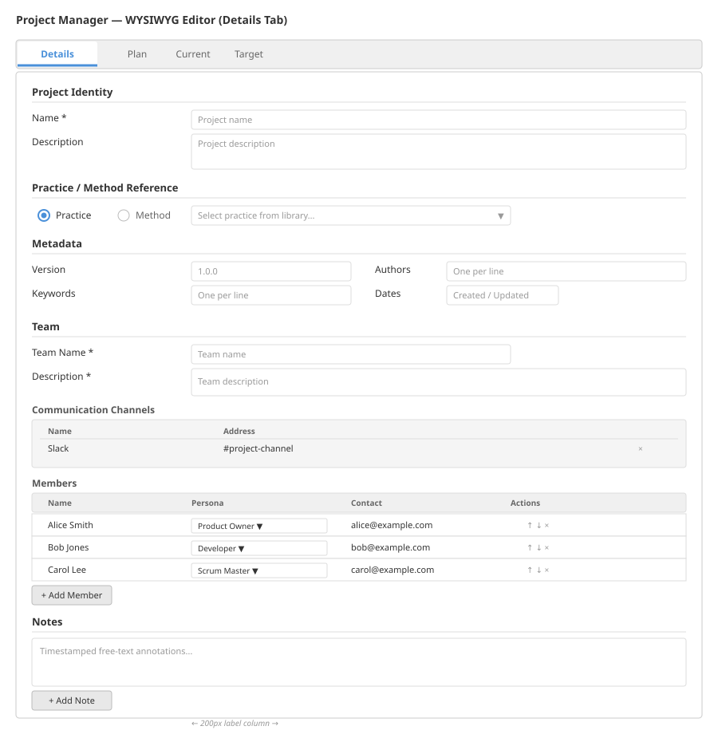
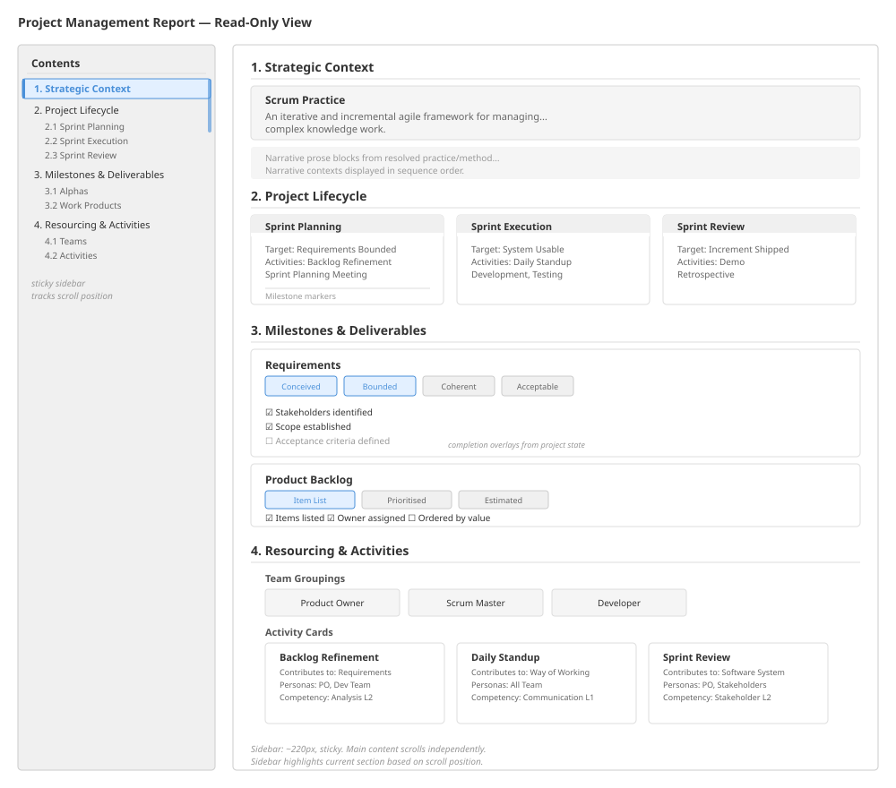

# Project Manager

## Purpose

The project manager is the editor and viewer for project tracking documents. A project is a bounded endeavour that tracks a team's state against a practice or method. It captures a lifecycle plan (as a pattern), the current state and target state of alpha and work product instances, team composition, and iterative cycles.

The project manager provides a WYSIWYG editing experience for authoring project documents and a structured read-only report view for reviewing project status. Both modes resolve the referenced practice or method from the library to populate dropdown options and cross-link project elements to their definitions.

---

## Data Model

The project manager operates on the `Project` document type defined in the domain model (Module 01). The key types are summarised here for context; the domain model is the authoritative source.

### Project

```
Project extends PracticeElement
  practiceName   : string           optional  -- exactly one of practiceName
  methodName     : string           optional  -- or methodName must be present
  plan           : ProjectPlan      required
  current        : ProjectStateSection  required
  target         : ProjectStateSection  required
  team           : TeamEntry        optional
  cycles         : ProjectCycle[]   optional
  currentCycleName : string         optional
  notes          : Note[]           optional
  authors        : string[]         optional
  createdAt      : string           optional
  updatedAt      : string           optional
  version        : string           optional
  keywords       : string[]         optional
  citations      : Citation[]       optional
  acknowledgements : Acknowledgement[]  optional
  assets         : Asset[]          optional
  schemaVersion  : string           optional
  dependencyVersions : DocumentVersionConstraint[]  optional
```

### ProjectPlan

```
ProjectPlan
  pattern : Pattern   required
  notes   : Note[]    optional
```

### ProjectStateSection

A snapshot of endeavour state, capturing positions of alpha and work product instances.

```
ProjectStateSection
  alphaInstances       : AlphaInstance[]       optional
  workProductInstances : WorkProductInstance[]  optional
  notes                : Note[]                optional
```

### ProjectCycle

A bounded period of work within a project (e.g., a sprint, an iteration, a phase).

```
ProjectCycle extends ProjectStateSection
  name            : string   required
  description     : string   optional
  startedAt       : string   optional
  completedAt     : string   optional
  patternViewName : string   optional  -- links to a pattern view in the plan
```

### TeamEntry

```
TeamEntry
  name                  : string                  required
  description           : string                  required
  communicationChannels : CommunicationChannel[]  optional
  members               : TeamMember[]            required
  notes                 : Note[]                  optional
```

### TeamMember

```
TeamMember
  name        : string   required
  personaName : string   required
  contact     : string   required
  started     : string   optional
  finished    : string   optional
```

---

## Editing

### Editing Modes

The project manager uses the same tri-modal editing approach as the practice author:

1. **WYSIWYG mode:** A structured form-based editor with tabs and specialised controls.
2. **YAML mode:** A text editor presenting the document as YAML. Edits are parsed and validated on switch back to WYSIWYG.
3. **JSON mode:** A text editor presenting the raw JSON. Same parse-and-validate behaviour on mode switch.

All three modes operate on the same underlying document. Switching between modes round-trips the content through serialisation and parsing. Invalid YAML or JSON prevents switching to WYSIWYG mode until the syntax is corrected.

### WYSIWYG Tab Structure



The WYSIWYG editor is organised into four tabs:

#### Tab 1 -- Details

- **Project identity:** Name, description, version, keywords, authors.
- **Practice or method reference:** A selector that allows the user to choose either a practice name or a method name from the library. The selector is mutually exclusive -- selecting one clears the other. The selected practice or method is resolved from the library to provide element names for dropdowns elsewhere in the editor.
- **Metadata:** Created and updated timestamps, schema version.
- **Team:** Team name, description, communication channels, and a member list. Each member has a name, a persona selector (populated from the resolved practice/method's personas), and a contact field with optional start and finish dates.
- **Notes:** Timestamped free-text annotations.

#### Tab 2 -- Plan

- **Pattern editor:** Full editing of the project's lifecycle pattern, including pattern views. Each pattern view represents a phase or milestone in the project plan.
- **Pattern views** can reference alpha states (as milestones), activity spaces, and activities from the resolved practice/method.

#### Tab 3 -- Current

- **Alpha instances:** A list of alpha instances, each tracking:
  - Alpha name (dropdown populated from the resolved practice/method's alphas).
  - Current state name (dropdown populated from the selected alpha's states).
  - Checklist states: For each checklist item in the selected state, a completion status selector (complete, not complete, not required) with optional evidence links and notes.
  - Background preconditions.
  - Links.
- **Work product instances:** A list of work product instances, each tracking:
  - Work product name (dropdown populated from the resolved practice/method's work products).
  - Current level of detail name (dropdown populated from the selected work product's levels).
  - Checklist states: Same structure as alpha instance checklists.
  - Background preconditions.
  - Links.

#### Tab 4 -- Target

Same structure as the Current tab, but captures the target (desired) state rather than the current state. All dropdowns and checklist structures are identical.

### Library Resolution for Editing

When the user selects a practice or method reference:

1. The referenced document is resolved from the library, including all dependencies (for practices, the baseline and dependency chain; for methods, the baseline and all constituent practices).
2. The resolved composite provides the full set of alpha names, state names, work product names, level of detail names, checklist names, persona names, activity names, and activity space names.
3. These names populate all dropdown selectors throughout the editor.
4. If the referenced document cannot be resolved (e.g., missing from the library), the editor displays a warning but remains functional -- text fields replace dropdowns for manual entry.

---

## Read-Only View (Project Management Report)

The read-only view presents the resolved project as a structured, multi-part report. It is designed for review and communication rather than editing.

### Report Structure



The report has four major sections, each with a distinct purpose:

#### Section 1 -- Strategic Context

- **Method identity:** The name and description of the resolved practice or method.
- **Narratives:** All narratives from the resolved practice/method, presented as contextual prose. Each narrative displays its narrative type name and its narrative contexts in sequence order.

#### Section 2 -- Project Lifecycle

- **Patterns as phases:** Each pattern from the resolved practice/method is presented as a lifecycle phase. Within each pattern:
  - Pattern views are displayed in sequence order, each showing:
    - The view name and description.
    - **Target milestones:** The alpha states declared in the view, presented as milestone markers.
    - **Contributing activities:** Activities that contribute to the target alpha states, cross-linked from the activity system. The linkage is computed by matching activity `contributesTo` entries against the view's `alphaStates`.

#### Section 3 -- Milestones and Deliverables

- **Alphas with state checklists:** Each alpha from the resolved practice/method is presented with its full state progression. Each state shows its checklist items. When the project's current or target state sections contain alpha instances for that alpha, the checklist states (complete, not complete, not required) are overlaid on the checklist display.
- **Work products with level of detail checklists:** Each work product is presented with its levels of detail and their checklists. Project-level work product instance checklist states are overlaid in the same manner.

#### Section 4 -- Resourcing and Activities

- **Persona groups as teams:** Each persona group from the resolved practice/method is presented as a team grouping.
- **Progressive flow diagram:** A visual representation of how activities flow through activity spaces, showing the temporal progression from the pattern system.
- **Personas with competencies:** Each persona is listed with its competency level requirements.
- **Activities as task cards:** Each activity is presented as a card showing its description, the alpha states it contributes to, the work products it works on, required competencies, and involved personas.

### Navigation Sidebar

The report includes a sticky navigation sidebar that:

1. Lists all four sections and their subsections as a hierarchical table of contents.
2. Tracks the user's scroll position and highlights the currently visible section in the sidebar.
3. Clicking a sidebar entry scrolls the main content to that section.

---

## Document Lifecycle

The project manager follows the same document lifecycle as the practice author:

1. **Create:** Initialise a new project document with default structure (empty plan, current, and target sections). The document is assigned a new identifier and persisted with kind `project`.
2. **Load:** Retrieve an existing project document by identifier. The referenced practice or method is resolved from the library to enable dropdown population and report rendering.
3. **Save:** Persist the current editor state. Timestamps are updated. Validation runs before save (relaxed mode permits drafts with incomplete references).
4. **Save As:** Persist a copy of the current document under a new identifier and title.
5. **Revert:** Discard unsaved changes and reload the last persisted version.
6. **Discard:** Delete the document from storage after confirmation.

Documents are persisted with kind `project` and participate in the standard document storage abstraction.

---

## Validation

Project documents are validated in two modes:

- **Strict mode:** All required fields must be present and all cross-references must resolve. Used for final validation before export or report generation.
- **Relaxed mode:** Allows missing optional fields and unresolvable references. Used during editing to permit incomplete drafts.

Validation checks include:
- Exactly one of `practiceName` or `methodName` is present.
- The `plan` section contains a valid pattern with at least one pattern view.
- Alpha instance references match alpha names in the resolved practice/method.
- Work product instance references match work product names in the resolved practice/method.
- State and level of detail references are valid within their parent alpha or work product.
- Checklist state references match checklist names within the selected state or level of detail.
- Team member persona names match persona names in the resolved practice/method.

---

## Integration Points

### Library Resolution

The project manager depends on the library subsystem to resolve the referenced practice or method. Resolution follows the same recursive dependency resolution used by the method builder, including cycle detection and version constraint checking.

### Practice Author

The project manager shares editor infrastructure with the practice author:
- The same code editor components are used for YAML and JSON modes.
- The same validation flow (strict and relaxed modes) is applied.
- The same document lifecycle operations (create, load, save, save-as, revert, discard) are used.

### Practice Navigator

The read-only report view shares display components with the practice navigator for rendering alpha state progressions, work product level progressions, activity cards, and persona listings.

### Storage Layer

Project documents are persisted through the standard document storage abstraction with kind `project`. They participate in the same CRUD operations, caching, and cache invalidation as all other document types.

### Dashboard

Project documents appear in dashboard sections and can be filtered by kind `project`. The completeness score for projects is computed from their resolved practice/method content.
