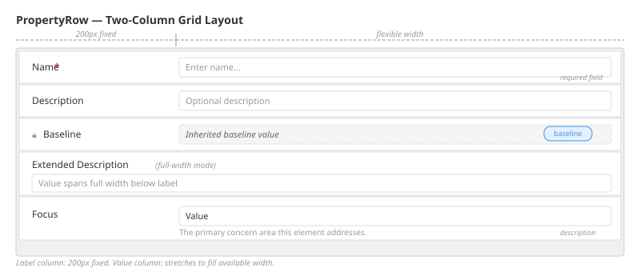
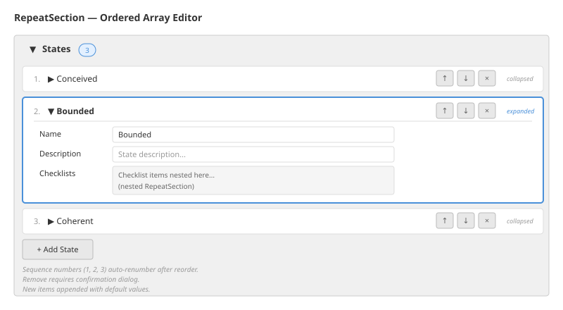
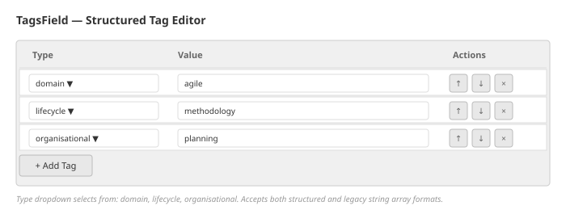

# Editor Components

## Purpose

Reusable field editors and container components for structured document editing. These components form the building blocks of the practice author, method builder, and project manager WYSIWYG editors.

---

## Container Components

### PropertyTable

A bordered container that wraps PropertyRow children with an optional title header. Provides consistent visual grouping for form sections.

### PropertyRow

A two-column grid layout: fixed-width label column (200px) and flexible value column.

Features:
- Required field marker (asterisk)
- Read-only lock icon (for baseline-sourced fields)
- Optional description text below the value
- Full-width mode (value spans both columns)

### RepeatSection

A generic reusable component for managing ordered arrays of typed records.

Features:
- Collapsible detail view per item
- Add new item (appends with defaults)
- Remove item (with confirmation)
- Move up / move down (reorder)
- Automatic seq field renumbering after reorder

### Section

A collapsible form section with heading and optional item count badge.

---

## Base Field Editors

### InlineTextField

Single-line text input. Props: value, onChange, placeholder, disabled, type. Visual: border on focus/blur transitions.

### InlineTextArea

Auto-sizing textarea that expands based on content line count. Props: value, onChange, onBlur, placeholder, disabled, minRows. Height adjusts dynamically -- no manual resizing needed.

### InlineSelectField

Dropdown selector. Props: value, onChange, options (string array), placeholder, allowEmpty. If the current value is not in the provided options list, it is added with a "(current -- not found in library)" suffix to prevent data loss.

### InlineReadonlyValue

Non-editable display field. Shows value with dashed border and italic styling. Includes a source badge indicating origin: "baseline" or "dependency". Used for fields that cannot be modified because they are inherited from a parent document.

---

## Domain-Specific Field Editors

### TagsField

Manages structured practice element tags with three categories: domain, lifecycle, and organisational. Renders an editable table with:
- Type selector dropdown (domain / lifecycle / organisational)
- Value text input
- Move up/down and remove buttons

Accepts both structured format (`{ domainTags, lifecycleTags, organizationalTags }`) and legacy string array format.

### NarrativesField

Manages an array of Narrative objects. Each narrative is a card with:
- Name and description text fields
- Narrative type selector (populated from available narrative types in the practice)
- Embedded NarrativeContextsField for managing narrative context entries
- Citation name references

Supports add, remove, and reorder operations.

### NarrativeContextsField

Manages the ordered list of narrative context entries within a narrative. Each entry has:
- Sequence number (auto-assigned)
- Narrative element name selector (from the narrative type's elements)
- Context text area (the actual narrative content)

### StringArrayField

Textarea where each line becomes an array element. Bidirectional conversion: array to newline-separated text for editing, text to array for storage.

### AlphaContributionsField

Table of `{ alphaName, stateName }` pairs. Features cascading dropdowns: selecting an alpha populates the available states for that alpha. Used for "contributes to" fields on activities and levels of detail.

### WorkProductContributionsField

Table of `{ workProductName, levelOfDetailName }` pairs. Same cascading pattern as AlphaContributionsField. Used for "works on" fields on activities.

### CompetencyLevelReferencesField

Table of `{ competencyName, competencyLevelName }` pairs. Cascading selectors for competency and level.

### PracticeDependenciesField

Table of practice name references with selectors populated from the library. Used for the practiceDependencyNames array on extension practices.

### AlphaInstancesField

For managing alpha instance references in pattern views. Each instance has alphaName, stateName, and optional evidence references.

### CitationsField

For managing citation entries with: authors (string array), date, title, source, URL. Academic reference format.

### NotesField

For managing timestamped notes with: name, timestamp, content, optional links.

### TeamMembersField

For managing team member entries with: name, personaName, contact, start/finish dates.

### CommunicationChannelsField

For managing team communication channel entries with: name, address.

### ChecklistStatesField

For managing checklist state tracking with: checklistName, state (complete / not complete / not required), evidence links, notes.

---

## Code Editors

### CodeEditor

Base code editor component with syntax highlighting and linting. Supports:
- JSON language mode
- YAML language mode
- Read-only mode
- Configurable height
- Light and dark theme support

### JsonEditor

Wraps CodeEditor with JSON language mode.

### YamlEditor

Wraps CodeEditor with YAML language mode.

---

## Floating Toolbar

A sticky sidebar toolbar that appears alongside the editor.

Actions:
- Copy field path (copies the JSON path of the focused field)
- Field info (shows type and constraints for the focused field)
- Inspect value (shows current value of the focused field)

Tracks which field is focused using a focus tracking system with a 150ms blur delay (keeps toolbar visible during field transitions).

---

## Integration Points

- All field editors communicate via value/onChange props (controlled component pattern)
- Document mutations use immutable path-based updates (e.g., `alphas[2].states[0].name`)
- Source tracking (ElementSourceMap) determines which fields render as read-only
- Available options for selectors (alphas, states, competencies, etc.) derived from the current document and resolved library context
