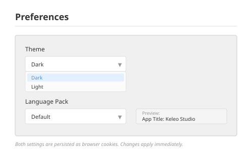

# Preferences

## Purpose

User-configurable display settings: visual theme and terminology pack.

---

## Theme System

Two built-in themes: light and dark.

### Theme Tokens

Theme tokens are CSS custom properties set on the root element:

| Token | Description |
|-------|-------------|
| `bg` | Page background |
| `panel` | Card/panel background |
| `text` | Primary text colour |
| `muted` | Secondary/dimmed text |
| `border` | Border colour |
| `accent` | Link/action colour |
| `bad` | Error/warning colour |
| `good` | Success colour |
| `colorScheme` | `"light"` or `"dark"` (affects native element styling) |
| `focusSwimlaneFill` | Per-focus background colours for swimlane diagrams (Value, Solution, Endeavor) |

### Built-in Themes

- **Dark:** Indigo-tinted dark backgrounds.
- **Light:** Neutral cool grays.

### Persistence

Theme preference persisted as a browser cookie. Applied by setting CSS custom properties on the root element.

---

## Language Pack System

### Built-in Packs

| Pack | Style | Example Terms |
|------|-------|---------------|
| `"default"` | Essence/OMG terminology | Alpha, State, Activity Space, Competency, Work Products |
| `"alt"` | Simplified terminology | Concept, Stage, Work Area, Capability, Deliverables |

### Pack Structure

Each pack is a record of ~190 string fields covering every user-facing label. Categories:

- App chrome (navigation labels, button text)
- Practice author UI (section headings, field labels)
- Library management (column headers, filter labels)
- Browse/navigator layout (section titles, action labels)
- Document sections (heading text)
- Pattern matrix labels
- Diagram labels

### Persistence

Pack preference persisted as a browser cookie. Components access labels via a context provider hook.

### Scope

This is a label-replacement system, not a full i18n framework -- no pluralisation, date formatting, or RTL support.

---

## Preferences Page

Simple form at `/preferences` with two controls:

1. **Theme selector** -- dropdown (dark / light)
2. **Language pack selector** -- dropdown (default / alt) with live preview of the selected pack's app title

---

## Integration Points

- Theme tokens consumed by all components via CSS custom property references
- Language pack consumed by all components via context hook
- Both are device-level preferences (cookies), not user-account or document-level
